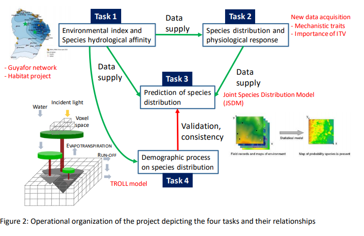
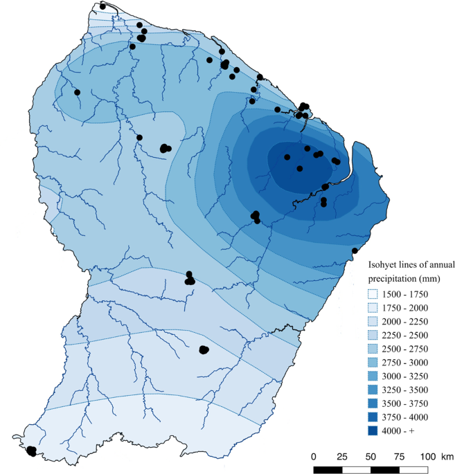

--- 
title: "Metradica"
author: "Marion Boisseaux"
date: "`r Sys.Date()`"
site: bookdown::bookdown_site
documentclass: book
bibliography: [book.bib, packages.bib]
# url: your book url like https://bookdown.org/yihui/bookdown
# cover-image: path to the social sharing image like images/cover.jpg
description: |
  This is a minimal example of using the bookdown package to write a book.
  The HTML output format for this example is bookdown::gitbook,
  set in the _output.yml file.
link-citations: yes
github-repo: mbthese/METRADICA
---

# About

Welcome to the *Metradica* project Github.

This repository supports all code and documentation about the project.

The global objectives of *Metradica* are to estimate species vulnerability to climate change and predict shifts in species distribution from species traits. The project is lead by Clement Stahl and Ghislain Vieilledent.

It combines: current species distribution, hydrological indices, climatic predictions, and use a few key traits at the individual level in innovative models (joint species distribution model; JSDMs), in order to better understand the processes by which species interact with their environment.

Part of my PhD project is included in the METRADICA strategic project. **Mechanistic traits to predict shifts in tree species abundance and distribution with climate change in the Amazonian forest.**

Have a nice reading !

<!--chapter:end:index.Rmd-->

# (PART) Part one: general introduction {-}

# Project introduction

My thesis is included in the METRADICA strategic project lead by Clement Stahl and Ghislain Vieilledent. **Mechanistic traits to predict shifts in tree species abundance and distribution with climate change in the Amazonian forest**. 

The global objectives of Metradica are to estimate species vulnerability to climate change and predict shifts in species distribution from species traits. 

It combines: current species distribution, hydrological indices, climatic predictions, and use a few key traits at the individual level in innovative models (joint species distribution model; JSDMs), in order to better understand the processes by which species interact with their environment.

There are 4 tasks : 
 
1. environmental index + species hydrological affinity 
2. species distribution + functional responses to env’t  
3. prediction of species distribution from traits using *four-corners* joint species distribution models 
4. shifts in species distribution through the lens of demographic process: interaction between models 



I am involved in task 2 : to acquire additional traits information in order to have an understanding of the environmental effect on intra- and inter- specific trait variability for morpho-anatomic and mechanistic traits at regional and local scales.

# Hypotheses 

**(1) Importance of local habitat in shaping functional strategies**

* Habitats are widely recognized to control trait variation 
* Identify species with statistically significant habitat associations
* Traits syndromes for specialists vs. generalists

*I will focus on topographic-driven variation in the water table, which is hypothesized to explain variation in forest responses to drought (Nobre et al.,2011) and species distribution (Schietti et al., 2014; Lourenço Jr. et al., 2021), where trees with higher hydraulic efficiency and drought sensitivity are mostly found in seasonally flooded habitats (Oliveira et al., 2019), which seems to buffer the impact of short-term droughts on Amazon forest survival and productivity (Esteban et al., 2020; Sousa et al., 2020).*

**(2) Evaluating the inter- and intra-specific variation of hydraulic and leaf traits**

* Metradica data : exploring generalists species ITV (~60 individuals per species)
* Hypothesis : because species' responses to the environment manifest through functional traits, the higher the ITV of a species is, the more diverse abiotic environments the species may be able to adapt to (Umaña et al., 2015).


**(3) Patterns of functional responses to drought along a precipitation and topographic gradient**

* Explore how trait values vary across a precipitation gradient (Bafog “dry” to Kaw “wet”) 
* Are associations among traits consistent along the gradient in each habitat? Species should converge to a set of trait values that maximize their resource use efficiency. (Vleminckx et al 2021) 
* Identify species in their limit range regarding drought resistance. 

*shifts in trait variation across environmental gradients can provide powerful insights into the drivers of community assembly* (Junior et al 2021)

<!--chapter:end:01-Introduction.Rmd-->

---
output: html_document
editor_options: 
  chunk_output_type: inline
---
```{r , include=FALSE}
rm(list = ls()) ; invisible(gc()) ; set.seed(42)
library(knitr)
library(kableExtra)
if(knitr:::is_html_output()) options(knitr.table.format = "html") 
if(knitr:::is_latex_output()) options(knitr.table.format = "latex") 
library(tidyverse)
theme_set(bayesplot::theme_default())
knitr::opts_chunk$set(
	echo = F,
	fig.height = 6,
	fig.width = 8,
	message = FALSE,
	warning = FALSE,
	cache = TRUE,
	cache.lazy = F
)
```

# (PART) Part two : Materials & Method {-}
# Sampling

## Sites

Permanent forest plots of the *Guyafor network* (https://paracou.cirad.fr/website/experimental-design/guyafor-network) monitor since 1970 individual tree growth and mortality in order to understand the different drivers of forest dynamics, including climate and disturbance. The network covers > 235 ha of tropical forest on 12 experimental sites. They are co-managed by the Cirad, CNRS and ONF institutes.


**Paracou **: The first site is Paracou field station (http://paracou.cirad.fr/), characterized by an average annual rainfall of 3102 mm and a mean air temperature of 25.7°C (Aguillos et al 2019). Sampling was done in six control permanent plots of 6.25 ha each with an elevation between 33-50 m (IGN-F). In total, 226 trees were sampled between 26/10/2020-7/12/2020 and 13/09/2021-17/09/2021.


**Bafog**: 5 permanent plots monitored of the ONF institute, characterized by an average annual rainfall of 2357 mm and a mean air temperature of 27.4°C (weather station of MétéoFrance). Sampling was done in 4-ha plots and with an elevation between 7-39 m (IGN-F). In total, 181 trees were sampled in the BAFOG site between 01/03/2021-18/03/2021. 

**Est**: The third site is the Kaw area characterized by an average annual rainfall of 3851 mm and a mean air temperature of 26.3°C (weather station of MétéoFrance). The area groups several plots (see Table. S3) with an elevation between 7-250 m (IGN-F). In total, 145 trees were sampled between 05/10/2021-20/10/2021.

The three sites were chosen in order to sample species along the rainfall gradient. 



## Habitats

The tropical forest of the Guianan Shield is characterized by heterogeneous meso-topographic conditions with numerous small hills, distinguishing two main contrasting habitats, terra firme (TF) forests and seasonally flooded forests (SF) (Ferry et al. 2010). 

* Terra firme covers 77 % of French Guiana. They are also called *plateau* and are higher areas characterized by a high clay content (47 %, Baraloto et al. 2021) and have a high water drainage. 

* Seasonally flooded habitats are located in the valleys, with a maximum slope of 1% and are characterized by relatively more fertile soils compared to terra firme forests (Baraloto et al. 2011). These soils are sandy (65%, Baraloto et al. 2021) and interestingly richer in phosphorus (Ferry et al. 2010; Baraloto et al. 2021). In SF forest, Tthe water table is never observed to descend below 60 cm depth, remaining at the soil surface for at least two consecutive months each year (Baraloto et al. 2007; Ferry et al. 2010) during the rainy season. The classification for waterlogged habitat may be loose and not as precise as for the *terra firme*, but it does not impact the sampling. *in natura*, we assess if the tree is really in a waterlogged habitat or not.

*How do we define seasonally flooded soils?* On maps, pixels located at an altitude difference of less than 2 m from the altitude of the nearest surface run-off of the same catchment area. **Pixels situés à moins de 2m de dénivelé du plus proche écoulement de surface appartenant au même bassin versant**.  Surface run-off corresponds to pixels receiving the waterflow of at least 75 pixels upstream. Everything is being calculated from the SRTM 30 m (after adjusting the basin area with fillings.) 

Gaelle information: 

* utilisation couche sig onf
* critere pente (inf 20° = BF, pente moins forte espece de lissage avec bc d’arbres en BF, durcissement des criteres, affiner et bien tomber dans du BF) *comment: SRTM pente 20° à 30m ne correspond pas n’ont plus à la pente sur le terrain, il y a une imprecision. but again in natura we make sure the tree is really in the corresponding habitat.*
* distance à la crique (inf 50m) (marginale)
 
**Soil nutrient availability** is another important driver of species distribution and plant community assembly in these forests (Quesada et al. 2012; Baldeck et al. 2013; Oliveira et al. 2019; Fortunel et al. 2020; Baraloto et al. 2021). The pre-Cambrian rocks of the Guiana Shield have been exposed to weathering and erosion for over 2 billion years, which has produced highly and therefore originate overall nutrient-poor soils (Flores et al. 2020; Grau et al. 2017; Soong et al. 2020). TF soils are richer in organic matter than SF, while SF soils havewhich distinguishes itself with a higher phosphorus content (Ferry et al. 2010).

The habitat classification of the tree species are based on all the past project achieved and mostly on HABITAT ONF project. 

```{r Soil analyses, echo=FALSE}
# Soil analyses from excel files given by Gaelle Jaouen 06/2022
# Compilation in Gentry from DIADEMA, AMALIN & BRIDGE projects led by Christopher Baraloto and Claire Fortunel
# Paracou data from Vincent Freycon & Bruno Ferry with metadata in Paracou Data dictionary
# Other data from GUYAFOR database 
# Soong et al 2022 data as well

#libraries----
library(readxl)
library(tidyverse)
library(dplyr)
library(ggplot2)
library(ggpubr)

# Paracou -------
## data----

library(readxl)
Data1_Paracou <- read_excel("C:/Users/marion.boisseaux/Dropbox/Mon PC (Jaboty20)/Documents/METRADICA/Divers/Sol/20220611PedoParacouCompletionSIG.xlsx")

Data2_all <- read_excel("C:/Users/marion.boisseaux/Dropbox/Mon PC (Jaboty20)/Documents/METRADICA/Divers/Sol/202206_DonneesSolSyntheseKawParBaf.xlsx")

## summary-----

Summary_TF <- Data1_Paracou %>% 
  filter(TopoEnSIG =="Plateau") %>%
  summarise(CARBONEORG, AZOTETOTAL, C_N, P_OLSEN, AL_ÉCH_KCL, H_ÉCH_KCL, CA_ÉCH, MG_ÉCH, K_ÉCH, NA_ÉCH, MO, CEC) %>%
  mutate(Habitat = "Terra firme") %>%
  drop_na()
  
Summary_Bottomland <- Data1_Paracou %>% 
  filter(TopoEnSIG =="Bottomland") %>%
  summarise(CARBONEORG, AZOTETOTAL, C_N, P_OLSEN, AL_ÉCH_KCL, H_ÉCH_KCL, CA_ÉCH, MG_ÉCH, K_ÉCH, NA_ÉCH, MO, CEC) %>%
  mutate(Habitat = "Seasonally flooded forest") %>%
  drop_na()

Summary_Swamp <- Data1_Paracou %>% 
  filter(TopoEnSIG =="Swamp") %>%
  summarise(CARBONEORG, AZOTETOTAL, C_N, P_OLSEN, AL_ÉCH_KCL, H_ÉCH_KCL, CA_ÉCH, MG_ÉCH, K_ÉCH, NA_ÉCH, MO, CEC) %>%
  mutate(Habitat = "Seasonally flooded forest") %>%
  drop_na()

Soil_Paracou <- bind_rows(Summary_Bottomland, Summary_Swamp, Summary_TF)


## graphs-----

yaxis <<- c(expression("Organic Carbon (%)"),
            expression("Nitrogen (‰)"),
            expression("C/N ratio"),
            expression("Phosphorus (mg/kg) extracted \n using Olsen method"),
            expression("Total Root Length (cm)"),
            expression("Al exchangeable \n in KCl (cmol+/kg)"),
            expression("H exchangeable \n in KCl (cmol+/kg)"),
            expression("Ca exchangeable \n by Metson method (cmol+/kg)"),
            expression("Mg exchangeable \n by Metson method (cmol+ / kg)"),
            expression("K exchangeable \n by Metson method (cmol+/ kg)"),
            expression("Na exchangeable \n by Metson method (cmol+ / kg)"),
            expression("Organic matter (%)"),
            expression("cation exchange capacity \n by method Metson (cmol+/ kg)")
)

count <- 0
Nbcol <- colnames(Soil_Paracou)[1:12]
plotlist <- list()

for (i in Soil_Paracou[,Nbcol]){
  count <- count + 1
  name <- names(Soil_Paracou[Nbcol[count]])
  
  plotlist[[name]] <- local({
   
    i <- i
    name <- names(Soil_Paracou[Nbcol[count]])
  
   ggplot(Soil_Paracou) +
 aes(x = Habitat, y = i, fill = Habitat) +
 geom_boxplot(adjust = 1L, scale = "area") +
 scale_fill_manual(values = list(`Seasonally flooded forest`= "#53CBE7", `Terra firme` = "#FFCB61")) +
 ylab(yaxis[count]) +
 theme_minimal() +
 theme(axis.title.x=element_blank(),axis.text.x=element_blank())
   
  })
  
}

plot_soil_var <- ggarrange(plotlist = plotlist,ncol = 4,nrow=3, common.legend = T, legend = "bottom")
                       
print(plot_soil_var)
```


**Topographic** variables are strong proxies for soil hydrology, which correlates with a combination of physico-chemical properties. A new hydrological index that accounts for both variations in climate and soil / topography across sites by combining the concept of MCWD with the one of Relative Extractable Water (e.g. Wagner et al. 2011) or Plant Available Water capacity (Nepstad et al. 2004, Ouédraogo et al. 2016). For Paracou, there is the topography classification established by Allié, Pélissier et al., 2015. *Sylvain*: The topographic wetness index (𝑇𝑊𝐼), identifies water accumulation areas. TWI was derived from 185 a 1-m resolution digital elevation model built based on data from a LiDAR campaign done in 186 2015 using SAGA-GIS (Conrad et al. 2015).


## Species

* **Specialist** species are species that have a habitat preference, either for *terra firme* soils or for seasonally flooded soils in French Guiana. 

* **Generalist** species are here defined as species able to thrive in the two contrasting habitats, they are regionally widespread and abundant species. 

**Indicator Species Analysis**

We explored the degree of habitat preference using **Indicator Species Analysis** (Dufrene & Legendre 1997). It takes account of both relative abundance and relative frequencies of each species across the two main habitats in French Guiana, seasonally flooded forest and Terra firme forests.

Habitat preferences were determined based on (Baraloto et al. 2021) study. The Dufrene and Legendre method (Dufrêne and Legendre 1997) was used as a measure of habitat association for each species in each habitat, while taking into account spatial auto-correlation with the MSR method (Wagner and Dray 2015). This measure, named IndVal for Indicator value, scales from 0 to 1 and integrates both the relative frequency of each species across plots in a given habitat and its relative abundance in each habitat. Out of the 654 species identified from (Baraloto et al. 2021), we only considered the 5 % highest Indval values in each habitat to qualify them as specialists of a habitat. This corresponded to a threshold of IndValSF specialist ≥  0.200 for SF specialists and IndValTF specialist ≥  0.259  for TF specialists. Those with an equal or lower IndVal in both habitats were considered without any habitat preference and therefore called generalists. 

Species with high IndVals means that the species prefers the habitat (but not exclusive, hence the word **preference**), but are also a high probability of being sampled in the given habitat.

We also wanted to maximize the phylogeny to get a greater picture, having specialists and generalists in the main clades: (Rosids, Asterids, Magnoliids). This would allow us to assess whether the different strategies to drought tolerance can be extend to the species of the same clade.  

We thus studied 21 tropical tree species, which included 6 generalist species, 9 SF specialist species, and 6 TF specialist species. 

```{r Species phylo, echo=FALSE, message=FALSE, warning=FALSE}
library(V.PhyloMaker)
library(ggtree)
species <- data.frame(taxon = c(
  "Eperua_falcata", 
  "Iryanthera_hostmannii", 
  "Jacaranda_copaia subsp. copaia",
  "Pterocarpus_officinalis",
  "Symphonia_globulifera",
  "Tachigali_melinonii",
  "Virola_surinamensis", 
  "Bocoa_prouacensis",
#  "Chrysophyllum_prieurii",
  "Conceveiba_guianensis",
  "Eschweilera_coriacea",
  "Hymenopus_heteromorphus",
  "Protium_stevensonii",
  "Virola_michelii",
  "Carapa_surinamensis",
#  "Carapa_guianensis",
  "Laetia_procera",
  "Protium_opacum subsp. rabelianum",
 # "Casearia_javitensis",
  "Dicorynia_guianensis",
  "Gustavia_hexapetala",
  "Iryanthera_sagotiana",
  "Licania_membranacea",
  "Poraqueiba_guianensis"
  #"Vouacapoua_americana"
))%>% separate(taxon, c("Genus", "Species"), sep = "_", remove = F)

species <- dplyr::select(species, taxon , Genus, Species)

paracou <- read_excel("../Metradica_Paracou/Document/Paracou_database20210830.xlsx") %>% 
  dplyr::select(Family, Genus, Species) %>% 
  unique() %>% 
  full_join(species) %>% 
  mutate(species = paste(Genus, Species), genus = Genus, family = Family) %>% 
  dplyr::select(species, genus, family, taxon) %>% 
  mutate(taxon = as.character(taxon))

tree <- phylo.maker(sp.list = paracou, tree = GBOTB.extended, nodes = nodes.info.1, scenarios = "S3")

#save(tree, file = "./Results/phylogeny_subset.Rdata")
#load("./Results/phylogeny_subset.Rdata")

A<- fortify(tree$scenario.3) %>% 
  mutate(species = gsub("_", " ", label)) %>% 
  left_join(paracou) %>% 
  ggtree(aes(col = taxon), layout="circular") + 
  geom_tiplab2(aes(alpha = !is.na(taxon), size = !is.na(taxon))) +
  theme_tree(legend.position='bottom', legend.text = element_text(face = "italic")) +
  scale_alpha_manual("taxon", values = c(0.2, 4)) +
  scale_size_manual("taxon", values = c(1, 4))

print(A)
```


```{r Indval, echo=FALSE}
#baraloto et al SI
indval_baraloto <- readxl::read_xlsx("C:/Users/marion.boisseaux/Dropbox/Mon PC (Jaboty20)/Documents/METRADICA/Divers/Species_choice_Indval/Indval_Peru_&_FG.xlsx")

indval_baraloto <- indval_baraloto %>% select(...8, ...9, ...10, ...11, ...12, ...13)

indval_FG <- indval_baraloto[-(1:4),-5]

indval_FG <- janitor::row_to_names(indval_FG, 1)

#calculating thresholds for habitat specialists
probs <- c(0.95)
quantiles_SF <- quantile(as.numeric(indval_FG$SF), prob=probs) # Top 5% highest values for SF specialists : indval >= 0.2 
#95% 
#0.2 
quantiles_TF <- quantile(as.numeric(indval_FG$TF), prob=probs) 
#   95% 
# 0.2598 

indval_FG$SF<- as.numeric(indval_FG$SF)
indval_FG$TF<- as.numeric(indval_FG$TF)

#SF specialists
Data_SF<- indval_FG %>%
  select(Species, Abund, SF, TF, `P-value`) %>%
  filter(SF >= 0.2) %>%
  rename(Indval_SF =SF, Indval_TF =TF)

#TF specialists
Data_TF<- indval_FG %>%
  select(Species, Abund,SF, TF, `P-value`) %>%
  filter(TF >= 0.2598)%>%
  rename(Indval_SF =SF, Indval_TF =TF)

#concerning our species
identified_species <- data.frame(Species = c("Eperua_falcata", 
  "Iryanthera_hostmannii", 
  "Jacaranda_copaia",
  "Pterocarpus_officinalis",
  "Symphonia_globulifera",
  "Tachigali_melinonii",
  "Virola_surinamensis", 
  "Bocoa_prouacensis",
  "Conceveiba_guianensis",
  "Eschweilera_coriacea",
  "Hymenopus_heteromorphus",
  "Protium_stevensonii",
  "Virola_michelii", 
  "Carapa_surinamensis", 
  "Laetia_procera",
  "Protium_opacum", 
  "Dicorynia_guianensis",
  "Gustavia_hexapetala",
  "Iryanthera_sagotiana",
  "Licania_membranacea",
  "Poraqueiba_guianensis"
  ))
  

Specialist_SF <- left_join(identified_species, Data_SF) %>% na.omit()

Specialist_TF <- left_join(identified_species, Data_TF) %>% na.omit()

Generalist_fort_indval_deux_habitats <- inner_join(Specialist_SF, Specialist_TF )


Specialist_TF <- Specialist_TF %>% 
  filter(Species != "Conceveiba_guianensis") %>% #con.gui species in both, removed it
  mutate(Type = "TF specialist")
Specialist_SF <- Specialist_SF %>% 
  filter(Species != "Conceveiba_guianensis") %>%#con.gui species in both, removed it
   mutate(Type = "SF specialist")


#indval graphs
indval_SF_plot <- Specialist_SF  %>%
  mutate(Species = fct_reorder(Species, Indval_SF)) %>% 
  ggplot(aes(x = Species, y = Indval_SF, fill = Species)) +
  geom_col() +
  scale_fill_brewer(palette = "YlGnBu", direction = 1) +
  theme_minimal() +
  # theme(palette = "Tol") #color blind palette
  theme(axis.text.x=element_text(angle=50, hjust = 1))+
  theme(legend.position="none")

print(indval_SF_plot)

#ggsave(file="indval_SF_plot.svg", plot=indval_SF_plot, width=10, height=8)
#ggsave(file="indval_SF_plot.png", plot=indval_SF_plot, width=10, height=8) 

indval_TF_plot<- Specialist_TF  %>%
  mutate(Species = fct_reorder(Species, Indval_TF)) %>% 
  ggplot(aes(x = Species, y = Indval_TF, fill = Species)) +
  geom_col() +
  scale_fill_brewer(palette = "YlOrRd", direction = 1) +
  theme_minimal() +
  # theme(palette = "Tol") #color blind palette
  theme(axis.text.x=element_text(angle=50, hjust = 1))+
  theme(legend.position="none")

print(indval_TF_plot)
#ggsave(file="indval_TF_plot.svg", plot=indval_TF_plot, width=10, height=8)
#ggsave(file="indval_TF_plot.png", plot=indval_TF_plot, width=10, height=8)

#now for generalists
Generalist <- left_join(identified_species, indval_FG) 

Generalist <- Generalist %>% rename(Indval_SF = SF, Indval_TF = TF)

Generalist <-  Generalist %>%
  na.omit() %>%
  filter(Indval_TF <= 0.2598) %>%
  filter(Indval_SF <= 0.2)

#cannot consider jas.jav.
Generalist <- Generalist %>% 
  filter(Species != "Casearia_javitensis") %>%
  filter(Abund != 5) 


Generalist_all  <-rbind(Generalist, Generalist_fort_indval_deux_habitats)


Generalist_all <- Generalist_all %>% 
  mutate(Diff_Indval = abs(Indval_SF-Indval_TF)) %>%
  mutate(Type = "Generalist")

Generalist_diff_indval<- ggplot(Generalist_all) +
   aes(x = Species, y = Diff_Indval, fill = Species) +
   geom_col() +
   scale_fill_brewer(palette = "RdYlBu", direction = 1) +
   theme_minimal() +#les couleurs en faveur des BF, tacmel proche d'un SF spe donc couleur bleu
  theme(axis.text.x=element_text(angle=50, hjust = 1))+
  theme(legend.position="none")

print(Generalist_diff_indval)
#ggsave(file="indval_generalist_diff_indval_plot.svg", plot=Generalist_diff_indval, width=10, height=8)
#ggsave(file="indval_generalist_diff_indval_plot.png", plot=Generalist_diff_indval, width=10, height=8)

```


*More details about IndVal* :

IndVal used by other projects (ex. INSERER BIBLIO TerSteege et al 2013). The relative abundance and the relative frequency must be combined by multiplication because they represent independent information about the species distribution. X100 for a percentage. The index is max when all individuals of a species are found in a single group of sites or when the species occurs in all sites of that group. The statistical significance of the species indicator values is evaluated using a randominization procedure. Significance of habitat association was estimated by a Monte Carlo procedure that reassigns species densities and frequencies to habitats 1000 times. It therefore gives an ecological meaning as it compares the typologies. 

*Other indicators* : 

* Contrary to **TWINSPAN**, this indicator index for a given species is independent of other species relative abundances and there is no need for pseudospecies
* Species richness (sensitive to several factors)
* Oliviera species association to the topographic and edaphic gradient : weighted the HAND or P concentration of the plot by the abundance of the species in the plot. Divided by the number of individuals of the species in all plots. 

## Individuals

The individuals were selected with a DBH value between the 10<sup>th</sup> and the 90<sup>th</sup> percentile of the species' distribution pattern, in order to have a sampling that best reflects the forest structure. In this percentile interval, species were randomly selected for sampling. 


*Total individuals collected for the paper.*

```{r Individuals per species collected in the three sampling sites., echo=FALSE}
library(tidyverse)
library(kableExtra)
library(janitor)

Family <- read.csv("C:/Users/marion.boisseaux/Dropbox/Mon PC (Jaboty20)/Documents/METRADICA/Divers/Species_choice_Indval/Supporting information - Species_SI.csv") %>% select(Family, Genus, Species)

#Marion's computer path METRADICA/Divers/Species_choice_Indval/Metradica_species_subset_total.csv

#campaign subset data
#data added to drive for co-authors
Data <- read.csv("C:/Users/marion.boisseaux/Dropbox/Mon PC (Jaboty20)/Documents/METRADICA/METRADICAproject/Dataset/OUTPUT_cleaning/Subset_imputed/Subset_imputation_exceptSD.csv") 

Paracou <- Data %>% 
  filter(Forest == "Paracou") %>%
  group_by(Name) %>%
  summarise(Paracou = n())

Bafog <- Data %>% 
  filter(Forest == "Bafog") %>%
  group_by(Name) %>%
  summarise(Bafog = n())

Kaw <- Data %>% 
  filter(Forest == "Kaw") %>%
  group_by(Name) %>%
  summarise(Kaw = n())

Paracou <- left_join(Paracou, Bafog)

Totaux_table <- left_join(Paracou, Kaw)

Data <- Data %>% dplyr::select(Genus, Species, Name) %>%unique()

Data <-   left_join(Totaux_table, Data)%>%
  relocate(Genus, .before =Name) %>%
  relocate(Species, .after = Genus)

Totaux_table <- left_join(Data, Family)

Totaux_table <- Totaux_table %>%
  select(-Name) %>%
  relocate(Family, .before="Genus") 

Totaux_table <- Totaux_table %>%
  replace(is.na(.), 0) %>%
  mutate(Total = rowSums(select(., -Family, -Genus, -Species)))

options(knitr.kable.NA = '') #replace NA by blank spaces in table

Totaux_table %>%
  adorn_totals("row") %>%
  adorn_totals("col") %>%
  kbl(caption = "Individuals per species collected on the 3 sites") %>% 
  kable_classic(full_width = F, html_font = "Cambria") %>%
  column_spec(2:3, italic = T) %>%
  row_spec(0, bold= T) %>%
  row_spec(22, background = "#666;", color = "white") %>%
  column_spec(7,  background = "#666;", color = "white" ) 
 #save_kable(file = "../METRADICAproject/Results/Tables_SI/Sampling_subset.png")

```

## Sampling strategy

* Maps were produced by QGIS software
* [**Field** protocol](../Metradica_Paracou/Document/Protocol/Field.Rmd)
* Fill the fieldworksheet [**Fieldworksheet**](../Metradica_Paracou/Document/Protocol/Feuille_terrain_releve.xlsx)
- [ ] Assess tree and branch height
- [ ] Assess tree and branch Dawkins : 

<!--chapter:end:02-Sampling.Rmd-->

---
output: html_document
editor_options: 
  chunk_output_type: inline
---
# Traits

To guarantee that measurements were carried out on healthy leaves, we assessed chlorophyll fluorescence with a fluorescence meter (Mini-PAM II, WALZ, Effeltrich, Germany), which measures the maximum quantum yield of photosystem II (Fv/Fm). Only leaves with a FvFm value above 0.65 were considered for the study. Knowing that the sampled leaves were healthy, we then measured nine leaf functional traits (Table 1) related to resource investment strategies through light interception and carbon assimilation (Wright et al. 2004) or hydraulic functioning (Rosas et al. 2019) :  

* leaf chemistry (C, N, K, P)
* leaf saturated water content (LSWC, g.g-1), 
* leaf water potential at which leaf cells lose turgor (TLP, MPa),
* leaf minimum conductance (gmin, mmol.m-2.s-1),
* major vein length density (MajVLA, mm.mm-2)
* stomatal density (SD, mm-2) 

## Water- and carbon-related traits

* **LSWC** : Leaf-saturated water content (g g−1) was calculated as the mass of leaf water (WT – WD) divided by leaf dry mass (WD).
* **$TLP$**: leaf water potential at which leaf cells lose turgor (MPa), a key drought tolerance trait. 
* **$g_{min}$**: leaf minimum conductance $mmol.m^{-2}.s^{-1}$ taking into account water losses through the cuticle and incompletely closed stomata. A key drought-avoidance trait. 
* **Stomatal characteristics (size, density)**: morphological characteristic at the crossroads between water loss and the maximum rate of photosynthesis.(*INSERER BIBLIO Julio V. Schneider 2016*)
* **Nervation density**: determining the capacity of water supply in leaves. (*INSERER BIBLIO Julio V. Schneider 2016*)
* **Leaf chemistry** : To assess the leaves' concentration in carbon, nitrogen and phosphorous.

## Additional traits

* **LA**: leaf area $cm^{2}$ : carbo- acquisition related trait which informs on the light capture strategy.

* **$\frac{Fv}{Fm}$**: maximum quantum yield of photosystem II, which reflects photosynthesis efficiency ($\mu mol . m^{-2} . s^{-1}/ \mu mol . m^{-2} . s^{-1}$). It is an indicator of photosynthetic performance, as it has been shown to be sensitive to drought constraints in tropical forests (*INSERER BIBLIO Manzi et al 2021*) but decline after other leaf hydraulic traits (*INSERER BIBLIO Trueba et al 2019*).

* **P<sub>midday</sub>**: Water potential at the driest point of the day. 

* **$\delta$ <sup>18</sup> O and $\delta$ <sup>13</sup> C** : Informs patterns of carbon and water use, related to water use efficiency. (*INSERER BIBLIO Farquhar et al 1989*) Measured in Vienna.

*Trait table*

```{r Trait summary intro table, include=FALSE}
library(tidyverse)
library(kableExtra)
library(janitor)
#get authorization
#googlesheets4::gs4_auth(scopes = "https://www.googleapis.com/auth/spreadsheets.readonly" )

trait_table <- googlesheets4::read_sheet("https://docs.google.com/spreadsheets/d/1-LBjUas_flNGwAlDGFvGoq6GyqQsBiFmmiJyFtQYkMU/edit#gid=0")


trait_table$Unit[trait_table$Abbreviation == 'K'] <- "g.kg<sup>-1</sup>"
trait_table$Unit[trait_table$Abbreviation == 'P'] <- "g.kg<sup>-1</sup>"
trait_table$Unit[trait_table$Abbreviation == 'gmin'] <- "mmol.m<sup>-2</sup>.s<sup>-1</sup>"

trait_table$Abbreviation[trait_table$Unit == 'mmol.m<sup>-2</sup>.s<sup>-1</sup>'] <- "<i>gmin</i>"

trait_table$Unit[trait_table$Abbreviation == 'LSWC'] <- "g.g<sup>-1</sup>"
trait_table$Unit[trait_table$Abbreviation == 'MajVLA'] <- "cm.cm<sup>-2</sup>"
trait_table$Unit[trait_table$Abbreviation == 'SD'] <- "mm<sup>-2</sup>"

```
```{r echo=FALSE}
options(knitr.kable.NA = '') #replace NA by blank spaces in table

trait_table %>%
  kbl(caption = "Table 1. Leaf functional traits.", escape = FALSE) %>%
  row_spec(0, bold = TRUE) %>% 
  kable_classic(full_width = F, html_font = "Cambria") #%>%
 # save_kable(file = "../Tables_SI/Trait_summary.png", zoom = 5)
```


## Protocols

* [**Field** protocol](./Documents/Protocol/Field.Rmd)
* [**$\pi_{TLP}$** protocol](./Documents/Protocol/Protocole_Ptlp.pdf)
* [**RWC** protocol](./Documents/Protocol/RWC_Boisseaux.docx)
* [**Stomata** protocol](./Documents/Protocol/Analyse Stomates_Marion.docx)
* [**FvFm** protocol](./Documents/Protocol/Fluo_Bellifa.docx)
* [**gmin** protocol](./Documents/Protocol/Gmin protocol.docx)
* [**leaf venation** protocol](./Documents/Protocol/ProtocolLeafVeins_MB_2.docx)

## Organisation

* Day 1
    * Fresh
        * On field: P<sub>midday</sub>
        * scan gmin leaves
        * fresh weight RWC 
        * **$g_{min}$** weight  
        * **Stomatal density** nail polish (3 replicates per indivual)
        * **$\frac{Fv}{Fm}$**
    
    * Day 2
        * saturated weight RWC
        * **$g_{min}$** finish weights (at least 2 points next day)
        * **$\pi_{TLP}$**
    
    * Day 5 (+72h)
        * Dry weight RWC
        
* Later on :
    * Stomatal observation and density counts 
    * Measure of vein densities 
    * Chemistry of dry-grinded leaves

<!--chapter:end:03-Traits.Rmd-->

---
title: "Distribution"
author: "Marion Boisseaux"
date: "04/05/2022"
output:
  html_document: default
  pdf_document: default
editor_options:
  chunk_output_type: inline
---

# Results

## Distribution of major traits 

A focus on the frequency distribution of traits of individuals within communities allows scaling up from organism to ecosystem level and assessing how ecological communities and ecosystems respond to climate drivers (Garnier et al 2016; Liu et al 2020).

The shape of trait distribution could have the potential to reveal the ecological significance of trends and tradeoffs in traits at the species level. A focus on the *mean * and the *variance* of the community trait distribution is rooted in the 
concept of phenotype-environment matching and environmental optimality, where species’ relative abundance is mediated by their traits, that is, “community assembly by trait selection”. To understand how community trait composition is affected by ecological processes. 

* use of community-weighted trait metrics CWM
* variance
* mean
* skewness (symmetry)
* kurtosis (measure of tailness with heavy tail referring to outliers)


```{r include=FALSE}
library(tidyverse)
library(dplyr)
library(factoextra)
library(FactoMineR)
library(Factoshiny)
library(corrplot) 
library(ggpubr)
library(agricolae)
library(rstatix)
library(kableExtra)
library(readxl)
library(gridExtra)
library(rio)
library(ggplot2)
```

```{r echo=TRUE, message=FALSE, warning=FALSE}

Metradica <- read.csv("C://Users/marion.boisseaux/Dropbox/Mon PC (Jaboty20)/Documents/METRADICA/METRADICAproject/Dataset/OUTPUT_cleaning/ALL/Final_Metradica_OUT_30112022.csv")

sub_data_TF <- Metradica %>%
  filter(Name %in% c("Dicorynia_guianensis", "Iryanthera_sagotiana", "Gustavia_hexapetala", "Licania_membranacea", "Poraqueiba_guianensis", "Virola_michelii")) %>% filter(Habitat == "TF")

sub_data_SF <- Metradica %>%
  filter(Name %in% c("Eschweilera_coriacea","Eperua_falcata", "Iryanthera_hostmannii", "Laetia_procera", "Protium_opacum subsp. rabelianum", "Pterocarpus_officinalis", "Symphonia_globulifera", "Virola_surinamensis", "Carapa_surinamensis")) %>% filter(Habitat == "BF")

sub_data_G <-  Metradica %>%
  filter(Name %in% c("Bocoa_prouacensis", "Conceveiba_guianensis", "Jacaranda_copaia subsp. copaia", "Hymenopus_heteromorphus", "Protium_stevensonii", "Tachigali_melinonii"))

sub_data <- bind_rows(sub_data_TF, sub_data_SF, sub_data_G)

sub_data <- sub_data %>% mutate(Type= ifelse(Name == 'Virola_michelii','TF',Type))

sub_data <- sub_data %>% mutate(Type= ifelse(Name == 'Eschweilera_coriacea','BF',Type))

Metradica <- sub_data #552 indv


Subdata_shapiro <- slice_sample(Metradica, n=30) # Shapiro test is used for small sample size (n=30)
```

### Water traits 

```{r echo=FALSE, warning=FALSE}
yaxis_water <<- c(expression("TLP"),
            expression("Gmin"),
            expression("SD"),
            expression("LSWC"))
#water

count <- 0
Nbcol <- match(yaxis_water,colnames(Metradica))
plotlist <- list()

for (i in Metradica[,Nbcol]){
  count <- count + 1
  name <- names(Metradica[Nbcol[count]])
  
  plotlist[[name]] <- local({
   
    i <- i
    name <- names(Metradica[Nbcol[count]])
  
   ggplot(Metradica) +
 aes(x = log(abs(i))) +
 geom_histogram(bins = 30L, fill = "#112446") +
 xlab(yaxis_water[count])+
 theme_minimal()
  })
  
}

plot_his_water <- ggarrange(plotlist = plotlist,ncol = 4,nrow=1, common.legend = T, legend = "bottom")
                       
print(plot_his_water)


#shapiro water


count <- 0
Nbcol <- match(yaxis_water,colnames(Subdata_shapiro))
plotlist <- list()

for (i in Subdata_shapiro[,Nbcol]){
  count <- count + 1
  name <- names(Subdata_shapiro[Nbcol[count]])
  
  plotlist[[name]] <- local({
   
    i <- i
    name <- names(Metradica[Nbcol[count]])
  
   shapiro.test(log(abs(Subdata_shapiro[[Nbcol[count]]])))
   
   
  })
  
  if (plotlist[[name]]$p.value > 0.05) {
  
print("Data is normal")
} else {  
    print("data is not normal")
  
}
  
}
```

The πtlp values in our data set were on average less negative than those previously reported in the literature (for moist tropical forests (Fig. 1) (Maréchaux 2015). There are several possible explanations for such a pattern, one of them being that as they conducted their measurements at the peak of the dry season, we also measured πtlp at the peak of the dry season, but 2020-2021 dry seasons were "wetter" than usual. Plants often acclimate πtlp during drought periods, through the accumulation of cell solutes, or osmotic adjustment. Such an adjustment results in a lowering of πtlp and can contribute to drought tolerance in vegetation world-wide (Wright et al. 1992; Abrams & Kubiske 1994; Cao 2000; Merchant et al. 2007; Zhu & Cao 2009; Bartlett, Scoffoni & Sack 2012b; Bartlett et al. 2014).

###Vein traits
```{r echo=FALSE, warning=FALSE}


yaxis_MajVLA <<- c(expression("midribVLA"),
            expression("SecondaryVLA"),
            expression("TertiaryVLA"),
            expression("MajVLA"))


count <- 0
Nbcol <- match(yaxis_MajVLA,colnames(Metradica))
plotlist <- list()

for (i in Metradica[,Nbcol]){
  count <- count + 1
  name <- names(Metradica[Nbcol[count]])
  
  plotlist[[name]] <- local({
   
    i <- i
    name <- names(Metradica[Nbcol[count]])
  
   ggplot(Metradica) +
 aes(x = log(abs(i))) +
 geom_histogram(bins = 30L, fill = "#112446") +
 xlab(yaxis_MajVLA[count])+
 theme_minimal()
  })
  
}

plot_his_veins <- ggarrange(plotlist = plotlist,ncol = 4,nrow=1, common.legend = T, legend = "bottom")
                       
print(plot_his_veins)


#shapiro veins


count <- 0
Nbcol <- match(yaxis_MajVLA,colnames(Subdata_shapiro))
plotlist <- list()

for (i in Subdata_shapiro[,Nbcol]){
  count <- count + 1
  name <- names(Subdata_shapiro[Nbcol[count]])
  
  plotlist[[name]] <- local({
   
    i <- i
    name <- names(Metradica[Nbcol[count]])
  
   shapiro.test(log(abs(Subdata_shapiro[[Nbcol[count]]])))
   
   
  })
  
  if (plotlist[[name]]$p.value > 0.05) {
  
print("Data is normal")
} else {  
    print("data is not normal")
  
}
  
}

#data is not normal for tertiaries, but that's fine. It graphically does look fine pourtant.

```


### Chemistry traits
```{r echo=FALSE, warning=FALSE}
yaxis_chem <<- c(expression("Nitrogen"),
            expression("Carbon"),
            expression("X.S"),
            expression("Phosphorous"),
            expression("Fe..g.kg."),
            expression("Mn..g.kg."),
            expression("Mg..g.kg."),
            expression("Al..g.kg."),
            expression("Ca..g.kg."),
            expression("Na..g.kg."),
            expression("Potassium"),
            expression("Cr..mg.kg."),
            expression("Cu..mg.kg."),
            expression("Ni..mg.kg."),
            expression("Pb..mg.kg."),
            expression("Rb..mg.kg."),
            expression("Sr..mg.kg."),
            expression("Zn..mg.kg."))
count <- 0
Nbcol <- match(yaxis_chem,colnames(Metradica))
plotlist <- list()

for (i in Metradica[,Nbcol]){
  count <- count + 1
  name <- names(Metradica[Nbcol[count]])
  
  plotlist[[name]] <- local({
   
    i <- i
    name <- names(Metradica[Nbcol[count]])
  
   ggplot(Metradica) +
 aes(x = log(abs(i))) +
 geom_histogram(bins = 30L, fill = "#112446") +
 xlab(yaxis_chem[count])+
 theme_minimal()
  })
  
}

plot_his_chem <- ggarrange(plotlist = plotlist,ncol = 3,nrow=6, common.legend = T, legend = "bottom")
                       
print(plot_his_chem)


# #shapiro chem
# 
# 
# count <- 0
# Nbcol <- match(yaxis_chem,colnames(Subdata_shapiro))
# plotlist <- list()
# 
# for (i in Subdata_shapiro[,Nbcol]){
#   count <- count + 1
#   name <- names(Subdata_shapiro[Nbcol[count]])
#   
#   plotlist[[name]] <- local({
#    
#     i <- i
#     name <- names(Metradica[Nbcol[count]])
#   
#    shapiro.test(log(abs(Subdata_shapiro[[Nbcol[count]]])))
#    
#    
#   })
#   
#   if (plotlist[[name]]$p.value > 0.05) {
#   
# print("Data is normal")
# } else {  
#     cat(name,"data is not normal")
#   
# }
#   
# }
# # 
# # 


```

Nitrogen data is not normal[1]
X.S data is not normal[1]
Mg..g.kg. data is not normal[1]
Ca..g.kg. data is not normal[1]

### DBH
```{r DBH, echo=FALSE, warning=FALSE}
#chem traits
count <- 0
count_water <- 0
count_majvla <- 0

Nbcol <- match(yaxis_chem,colnames(Metradica))
Nbcol_water <- match(yaxis_water, colnames(Metradica))
Nbcol_majvla <- match(yaxis_MajVLA, colnames(Metradica))

plotlist <- list()
plotlist_water <- list()
plotlist_majvla <- list()


for (i in Metradica[,Nbcol]){
  count <- count + 1
  name <- names(Metradica[Nbcol[count]])
  
  plotlist[[name]] <- local({
   
    i <- i
    name <- names(Metradica[Nbcol[count]])
  
   ggplot(Metradica) +
 aes(x= DBH,y = log(abs(i))) +
 geom_point(bins = 30L, fill = "#112446") +
 ylab(yaxis_chem[count])+
 theme_minimal()
  })
  
}
for (i in Metradica[,Nbcol_water]){
  count_water <- count_water + 1
  name <- names(Metradica[Nbcol_water[count_water]])
  
  plotlist_water[[name]] <- local({
   
    i <- i
    name <- names(Metradica[Nbcol_water[count_water]])
  
   ggplot(Metradica) +
 aes(x= DBH,y = log(abs(i))) +
 geom_point(bins = 30L, fill = "#112446") +
 ylab(yaxis_water[count_water])+
 theme_minimal()
  })
  
}
for (i in Metradica[,Nbcol_majvla]){
  count_majvla <- count_majvla + 1
  name <- names(Metradica[Nbcol_majvla[count_majvla]])
  
  plotlist_majvla[[name]] <- local({
   
    i <- i
    name <- names(Metradica[Nbcol_majvla[count_majvla]])
  
   ggplot(Metradica) +
 aes(x= DBH,y = log(abs(i))) +
 geom_point(bins = 30L, fill = "#112446") +
 ylab(yaxis_MajVLA[count_majvla])+
 theme_minimal()
  })
  
}

plot_DBH_chem <- ggarrange(plotlist = plotlist,ncol = 3,nrow=6, common.legend = T, legend = "bottom")
plot_DBH_water <- ggarrange(plotlist = plotlist_water,ncol = 4,nrow=1, common.legend = T, legend = "bottom")
plot_DBH_majvla <- ggarrange(plotlist = plotlist_majvla,ncol = 4,nrow=1, common.legend = T, legend = "bottom")
                       
print(plot_DBH_chem)
print(plot_DBH_water)
print(plot_DBH_majvla)
```


### Crown position 
```{r echo=FALSE, warning=FALSE}
Dawkins <- read.csv("C://Users/marion.boisseaux/Dropbox/Mon PC (Jaboty20)/Documents/METRADICA/Trait_Data_Cleaning/information_sites_and_tree_individuals/FieldSheets/input/Metradica/output/Metradica_all_fieldsheet.csv") %>% select(Code, TreeDawkins, BranchDawkins, CrownPosition)

Dawkins$TreeDawkins <- as.character(Dawkins$TreeDawkins)
Dawkins$BranchDawkins <- as.character(Dawkins$BranchDawkins)

Study_dawkins <- left_join(Metradica, Dawkins, by ="Code")

count <- 0
count_j <- 0
count_water <- 0
count_majvla <- 0

Nbcol <- match(yaxis_chem,colnames(Study_dawkins))
Nbcol_water <- match(yaxis_water, colnames(Study_dawkins))
Nbcol_majvla <- match(yaxis_MajVLA, colnames(Study_dawkins))
Nbcol_dawkins <- match(colnames(Dawkins), colnames(Study_dawkins))

plotlist <- list()
plotlist_water <- list()
plotlist_majvla <- list()

#chem and crownposition
for (i in Study_dawkins[,Nbcol]){
  count <- count + 1
  name <- names(Study_dawkins[Nbcol[count]])
  
  for (j in Study_dawkins[,Nbcol_dawkins]){
    
    plotlist[[name]] <- local({
   
    i <- i
    j <- j
    name <- names(Study_dawkins[Nbcol[count]])
     ggplot(Study_dawkins) +
 aes(x= j,y = log(abs(i))) +
 geom_point(bins = 30L, fill = "#112446") +
 ylab(yaxis_chem[count])+
 theme_minimal()
   })
    
  }
    
}

count <- 0
#for crownposition and water

for (k in Study_dawkins[,Nbcol_water]){
  count <- count + 1
  name <- names(Study_dawkins[Nbcol_water[count]])
  
  for (j in Study_dawkins[,Nbcol_dawkins]){
    
    plotlist_water[[name]] <- local({
   
    k <- k
    j <- j
    name <- names(Study_dawkins[Nbcol_water[count]])
     ggplot(Study_dawkins) +
 aes(x= j,y = log(abs(k))) +
 geom_point(bins = 30L, fill = "#112446") +
 ylab(yaxis_water[count])+
 theme_minimal()
   })
    
  }
    
}

#crown position and veins

count <- 0
for (i in Study_dawkins[,Nbcol_majvla]){
  count <- count + 1
  name <- names(Study_dawkins[Nbcol_majvla[count]])
  
  for (j in Study_dawkins[,Nbcol_dawkins]){
    
    plotlist_majvla[[name]] <- local({
   
    i <- i
    j <- j
    name <- names(Study_dawkins[Nbcol_majvla[count]])
     ggplot(Study_dawkins) +
 aes(x= j,y = log(abs(i))) +
 geom_point(bins = 30L, fill = "#112446") +
 ylab(yaxis_MajVLA[count])+
 theme_minimal()
   })
    
  }
    
}
plot_CP_chem <- ggarrange(plotlist = plotlist,ncol = 3,nrow=6, common.legend = T, legend = "bottom")
plot_CP_water <- ggarrange(plotlist = plotlist_water,ncol = 4,nrow=1, common.legend = T, legend = "bottom")
plot_CP_majvla <- ggarrange(plotlist = plotlist_majvla,ncol = 4,nrow=1, common.legend = T, legend = "bottom")
                       
print(plot_CP_chem)
print(plot_CP_water)
print(plot_CP_majvla)


```


### TreeDawkins 
```{r echo=FALSE, warning=FALSE}
Dawkins <- read.csv("C://Users/marion.boisseaux/Dropbox/Mon PC (Jaboty20)/Documents/METRADICA/Trait_Data_Cleaning/information_sites_and_tree_individuals/FieldSheets/input/Metradica/output/Metradica_all_fieldsheet.csv") %>% select(Code, TreeDawkins, BranchDawkins)

Dawkins$TreeDawkins <- as.character(Dawkins$TreeDawkins)
Dawkins$BranchDawkins <- as.character(Dawkins$BranchDawkins)

Study_dawkins <- left_join(Metradica, Dawkins, by ="Code")

count <- 0
count_water <- 0
count_majvla <- 0

Nbcol <- match(yaxis_chem,colnames(Study_dawkins))
Nbcol_water <- match(yaxis_water, colnames(Study_dawkins))
Nbcol_majvla <- match(yaxis_MajVLA, colnames(Study_dawkins))

plotlist <- list()
plotlist_water <- list()
plotlist_majvla <- list()

#chem and treedawkins
for (i in Study_dawkins[,Nbcol]){
  count <- count + 1
  name <- names(Study_dawkins[Nbcol[count]])
  
    plotlist[[name]] <- local({
   
    i <- i
    name <- names(Study_dawkins[Nbcol[count]])
     ggplot(Study_dawkins) +
  aes(y = log(abs(i)), fill = TreeDawkins) +
  geom_boxplot() +
  ylab(yaxis_chem[count])+
  scale_fill_brewer(palette = "Pastel2", direction = 1) +
  theme_minimal()
   })
    
}

#water and treedawkins
for (i in Study_dawkins[,Nbcol_water]){
  count_water <- count_water + 1
  name <- names(Study_dawkins[Nbcol_water[count_water]])
  
    plotlist_water[[name]] <- local({
   
    i <- i
    name <- names(Study_dawkins[Nbcol_water[count_water]])
     ggplot(Study_dawkins) +
  aes(y = log(abs(i)), fill = TreeDawkins) +
  geom_boxplot() +
  ylab(yaxis_water[count_water])+
  scale_fill_brewer(palette = "Pastel2", direction = 1) +
  theme_minimal()
   })
    
}

#veins and treedawkins
for (i in Study_dawkins[,Nbcol_majvla]){
  count_majvla <- count_majvla + 1
  name <- names(Study_dawkins[Nbcol_majvla[count_majvla]])
  
    plotlist_majvla[[name]] <- local({
   
    i <- i
    name <- names(Study_dawkins[Nbcol_majvla[count_majvla]])
     ggplot(Study_dawkins) +
  aes(y = log(abs(i)), fill = TreeDawkins) +
  geom_boxplot() +
  ylab(yaxis_MajVLA[count_majvla])+
  scale_fill_brewer(palette = "Pastel2", direction = 1) +
  theme_minimal()
   })
    
}

plot_TreeDawkins_chem <- ggarrange(plotlist = plotlist,ncol = 3,nrow=6, common.legend = T, legend = "bottom")
plot_TreeDawkins_water <- ggarrange(plotlist = plotlist_water,ncol = 4,nrow=1, common.legend = T, legend = "bottom")
plot_TreeDawkins_majvla <- ggarrange(plotlist = plotlist_majvla,ncol = 4,nrow=1, common.legend = T, legend = "bottom")
                       
print(plot_TreeDawkins_chem)
print(plot_TreeDawkins_water)
print(plot_TreeDawkins_majvla)


```

## Gmin

The capacity to retain water will become increasingly important for survival of tropical trees. Along with other plant hydraulic traits, cuticle conductance may strongly affect survival during droughts (Cochard, 2020).

```{r gmin-plot, message=FALSE, warning=FALSE}
library(ggplot2)
library(plotly)
library(ggplot2)
library(cowplot)

#gmin with all species- interactive graph
plot_ly(Metradica, x=~Name, y = ~Gmin, color = ~Name, type = "box", showlegend = FALSE) %>% layout(yaxis = list(title ='Minimal conductance (mmol.m-2.s-1)'),  xaxis = list(categoryorder = "total ascending")) %>% layout(xaxis=list(showticklabels = TRUE)) %>% layout(xaxis = list(title =FALSE))

#forest
options(digits = 10)
means <- aggregate(Gmin ~Forest, Metradica, mean)
Metradica$Forest  <- factor(Metradica$Forest, levels=c("Bafog", "Paracou", "Kaw"))

A<-  ggplot(Metradica) +
  aes(x = Forest, y = log(Gmin), fill = Forest, group = Forest) +
 geom_boxplot(shape = "circle") +
 scale_fill_manual(values = list(Bafog = "#ED9210", Kaw = "#0C8FCD", Paracou = "#10C65B")) +
  labs(
    x = "",
    y = "Minimal conductance (mmol.m-2.s-1)"
  ) +
  stat_summary(fun.y="mean", colour = "red", geom="point") +
 theme_minimal() +
  stat_compare_means(method = "anova", label = "p.signif")


B <- ggplot(Metradica) +
 aes(x = Forest, y = Gmin, colour = Name) +
 geom_boxplot(shape = "circle", fill = "#112446") +
  labs(
    x = "Forest sites",
    y = ""
  ) +
 scale_color_hue(direction = 1) +
 theme_minimal() +
  theme(legend.position="bottom")


ggarrange(ncol = 1, plotlist = list(A, B), nrow = 2)


```


*interpretation* Across all species and all sites, gmin averaged 4.02 mmol.m-2.s-1. Gmin varied significantly among species (F-statistic: 18.10326,  p-value: < 2.2204e-16). Across sites, gmin ranged from 3.08 mmol m–2 s–1 in Paracou to 3.60 mmol m–2 s–1 in Kaw to 5.47 mmol.m-2.m-1 i Bafog and site differences were significant (F-statistic:  50.0139,  p-value: < 2.2204e-16). 

It is unclear whether a higher gmin in the Bafog site is assigned to stomatal opening or a higher permeability of the cuticle. We may need to consider soil water access as an additional factor to understand the pattern.

*literature* Slot et al 2021 found across 24 tropical species an average gmin of 4.0 mmol m–2 s–1. Large differences among species in cuticular water loss have the potential to contribute to differential mortality during drought, phenomena that are increasingly common in the tropics (Rifai et al 2019)

* **compare with stomatal density** 
* **see if more trichomes for bafog site that could explain why these species can afford to have a higher gmin?**

## LSWC

One of the direct results of the regulation of stomatal movement is the reduction of water loss through transpiration by adjusting the leaf stomatal conductance, to achieve a high water-use efficiency and prevent embolism, which is called isohydric behavior. In contrast, the leaf stomatal conductance is kept at a relatively high level to maintain efficiently photosynthesis, which is known as anisohydric behavior (Roman et al., 2015). Therefore, LSWC reflect the plant's response to drought. (Zhou et al 2021)

```{r LSWC plot1, warning=FALSE}
plot_ly(Metradica, x=~Name, y = ~LSWC, color = ~Name, type = "box", showlegend = FALSE) %>% layout(yaxis = list(title ='LSWC (g.g-1)'),  xaxis = list(categoryorder = "total ascending")) %>% layout(xaxis=list(showticklabels = TRUE)) %>% layout(xaxis = list(title =FALSE))

#forest
options(digits = 10)
means <- aggregate(LSWC ~Forest, Metradica, mean)
Metradica$Forest  <- factor(Metradica$Forest, levels=c("Bafog", "Paracou", "Kaw"))

A<-  ggplot(Metradica) +
  aes(x = Forest, y = log(LSWC), fill = Forest, group = Forest) +
 geom_boxplot(shape = "circle") +
 scale_fill_manual(values = list(Bafog = "#ED9210", Kaw = "#0C8FCD", Paracou = "#10C65B")) +
  labs(
    x = "",
    y = "LSWC"
  ) +
  stat_summary(fun.y="mean", colour = "red", geom="point") +
 theme_minimal() +
  stat_compare_means(method = "anova", label = "p.signif")

B <- ggplot(Metradica) +
  aes(x = "", y = LSWC, fill = Type) +
  geom_boxplot() +
  scale_fill_manual(
    values = c(BF = "#6274A5",
    Generalist = "#00C19F",
    TF = "#BEB41F")
  ) +
  theme_minimal()


C <- ggplot(Metradica) +
 aes(x = Forest, y = LSWC, colour = Name) +
 geom_boxplot(shape = "circle", fill = "#112446") +
  labs(
    x = "Forest sites",
    y = ""
  ) +
 scale_color_hue(direction = 1) +
 theme_minimal() +
  theme(legend.position="bottom")


ggarrange(ncol = 1, plotlist = list(A,C), nrow = 2)
print(B)


``` 

## TLP

```{r}
plot_ly(Metradica, x=~Name, y = ~TLP, color = ~Name, type = "box", showlegend = FALSE) %>% layout(yaxis = list(title ='TLP'),  xaxis = list(categoryorder = "total ascending")) %>% layout(xaxis=list(showticklabels = TRUE)) %>% layout(xaxis = list(title =FALSE))

#forest
options(digits = 10)
means <- aggregate(TLP ~Forest, Metradica, mean)
Metradica$Forest  <- factor(Metradica$Forest, levels=c("Bafog", "Paracou", "Kaw"))

A<-  ggplot(Metradica) +
  aes(x = Forest, y = log(abs(TLP)), fill = Forest, group = Forest) +
 geom_boxplot(shape = "circle") +
 scale_fill_manual(values = list(Bafog = "#ED9210", Kaw = "#0C8FCD", Paracou = "#10C65B")) +
  labs(
    x = "",
    y = "TLP"
  ) +
  stat_summary(fun.y="mean", colour = "red", geom="point") +
 theme_minimal() +
  stat_compare_means(method = "anova", label = "p.signif")

B <- ggplot(Metradica) +
  aes(x = "", y = TLP, fill = Type) +
  geom_boxplot() +
  scale_fill_manual(
    values = c(BF = "#6274A5",
    Generalist = "#00C19F",
    TF = "#BEB41F")
  ) +
  theme_minimal()


C <- ggplot(Metradica) +
 aes(x = Forest, y = TLP, colour = Name) +
 geom_boxplot(shape = "circle", fill = "#112446") +
  labs(
    x = "Forest sites",
    y = ""
  ) +
 scale_color_hue(direction = 1) +
 theme_minimal() +
  theme(legend.position="bottom")


ggarrange(ncol = 1, plotlist = list(A,C), nrow = 2)
print(B)

```


Leaf turgor loss point (πtlp) indicates the capacity of a plant to maintain cell turgor pressure during dehydration, which has been proven to be strongly predictive of the plant response to drought. 


* The variability in πtlp among species indicates the potential for a 
range of species responses to drought within Amazonian forest communities. 

* For *Symphonia globulifera* we couldn't exclude first- and second-order veins (that may have resulted in apoplastic dilution that would lead to less negative osmometer values (Kikuta & Richter 1992)). Eventhough it does not appear to be an outlier, we still have too keep in mind that the overall values would be more negative. 

* We found lower TLP values (less negative) for 7 species (above - 1.6 MPa):
  - *Dicorynia guianensis* (as Maréchaux et al 2015)
  - *Eschweleira coriacea *  (as Maréchaux et al 2015)
  - *Hymenopus heteromorphus*
  - *Iryanthera sagotiana*
  - *Iryanthera hostmannii*
  - *Jacaranda copaia subsp. copaia*
  - *Pterocarpus officinalis*

* We found higher TLP values (more negative) for 10 species (below - 1.87 MPa) including *Voucapoua americana* and both *Protium* species like Maréchaux et al 2015. Protium species have been found in more seasonally dry forests across the Amazonia (Ter Steege et al 2006). 


*Litterature* 
* The paper by Zhu et al. (2018) in this issue of Tree Physiology provides a meta-analysis of TLP and its relationship to a range of hydraulic traits linked to drought tolerance, as well as to leaf economic traits, across an impressive 389 species (of which, data for 240 are published for the first time) from nine major forest types in China. 

*adjustments in leaf structure in response to seasonal water deficit (Niinemets 2001, Mitchell et al. 2008) and altered nutrient concentrations (Villagra et al. 2013) drive changes in leaf water relations traits, including TLP. Blackman 2018

*This plant functional trait represents the leaf water potential that induces wilting. Leaves with a more negative πtlp (measured in MPa) remain turgid at more negative water potentials and tend to maintain critical processes, such as leaf hydraulic conductance, stomatal conductance and photosynthetic gas exchange, under drier conditions (Cheung, Tyree & Dainty 1975; Abrams, Kubiske & Steiner 1990; Brodribb et al. 2003; Bartlett, Scoffoni & Sack 2012b; Guyot, Scoffoni & Sack 2012). Thus, a more negative value for πtlp contributes to greater leaf-level drought tolerance and therefore also plant-level drought tolerance. 


## MajVLA

```{r echo=FALSE}
plot_ly(Metradica, x=~Name, y = ~MajVLA, color = ~Name, type = "box", showlegend = FALSE) %>% layout(yaxis = list(title ='MajVLA'),  xaxis = list(categoryorder = "total ascending")) %>% layout(xaxis=list(showticklabels = TRUE)) %>% layout(xaxis = list(title =FALSE))

#forest
options(digits = 10)
means <- aggregate(MajVLA ~Forest, Metradica, mean)
Metradica$Forest  <- factor(Metradica$Forest, levels=c("Bafog", "Paracou", "Kaw"))

A<-  ggplot(Metradica) +
  aes(x = Forest, y = log(abs(MajVLA)), fill = Forest, group = Forest) +
 geom_boxplot(shape = "circle") +
 scale_fill_manual(values = list(Bafog = "#ED9210", Kaw = "#0C8FCD", Paracou = "#10C65B")) +
  labs(
    x = "",
    y = "MajVLA"
  ) +
  stat_summary(fun.y="mean", colour = "red", geom="point") +
 theme_minimal() +
  stat_compare_means(method = "anova", label = "p.signif")

B <- ggplot(Metradica) +
  aes(x = "", y = MajVLA, fill = Type) +
  geom_boxplot() +
  scale_fill_manual(
    values = c(BF = "#6274A5",
    Generalist = "#00C19F",
    TF = "#BEB41F")
  ) +
  theme_minimal()


C <- ggplot(Metradica) +
 aes(x = Forest, y = MajVLA, colour = Name) +
 geom_boxplot(shape = "circle", fill = "#112446") +
  labs(
    x = "Forest sites",
    y = ""
  ) +
 scale_color_hue(direction = 1) +
 theme_minimal() +
  theme(legend.position="bottom")


ggarrange(ncol = 1, plotlist = list(A,C), nrow = 2)
print(B)
```


<!--chapter:end:04-Distribution.Rmd-->

---
title: "Literature"
author: "Marion Boisseaux"
date: "08/03/2022"
output: html_document
---
# Waterlogging litterature

- From **Abiotic Stress Physiology of Horticultural Crops** *edited by N.K. Srinivasa Rao, K.S. Shivashankara, R.H. Laxman*

Section 1.3 : one of the earliest responses to soil flooding is a reduction in stomatal conductance, inhibition of stomatal aperture. Low O2 level may also reduce hydraulic conductivity and csqtly decrease root permeability. This descrease in hydraulic permeability may b liked to aqaporins [...] limiting water uptake and this leading to internal water deficit. Oxygen deficiency generally induces a rapid reduction in the rate of photoS which is generally considered as the result of reduced stomatal aperture, decrease in leaf chloro content + early leaf senescence and a reduction in LA. Waterlogged soils reduce the translocation of photoS product from 'source' to 'sink' root. As a result, the maintenance of photoS acitivity and accumulation of soluble sugar in roots are clearly important adaptations to flooding. 

Plant responses to waterlogging include low stomatal conductance, decrease in leaf, root, and shoot dev't, changes in osmotic potential and nu uptake, reduced chloro content and photoS.

The oxygen diffusion is 10,000 times slower in waterlogged soils as compared to aerated soil. 

The decrease in O evel in soils affects the bioavailability of nu and as well as the ability of root systems to uptake and transport water + mineral nu. Waterlogging also causes inhibition of N-uptake from the soil and reducedleaf concentrations of N, P, K, Ca, Mg in avocado + pea. 

# general potential hypotheses

with waterlogging: i should find a decrease of stomatal conductance corrolated with an increase of leaf water potential.

<!--chapter:end:80-Literature.Rmd-->

---
title: "Meeting Notes"
author: "Marion Boisseaux"
date: "31/01/2022"
output:
  pdf_document: default
  html_document: default
---
# (PART) Part four : Notes {-}

# 26/01/2022

Metradica meeting 

Presents: 
 
* Ghislain 
* Clément  
* Sabrina 
* Damien  
* Jeanne 
* Marion 

Objectives: 
 
1- les données 13C  
2- les modèles joints 

**Notes:**

(1) 

L'estimation de l'efficience d'utilisation de l'eau intrinsèque peut être obtenue à l'aide de msures directes des échanges gazeux entre feuille et atm. Farquar 1982 propose un modèle simple reliant WUE (water use efficiency) à la discrimination isotopique du C au cours de la photosynthèse. 

Relation WUE et $\delta$ 13C positive.

Drivers de la compo iso: 

* Lumière (feuille d'ombre valeurs 13C nettement plus négatives) 
* génétique 
* sécheresse atm + sol 
* VPD 
* teneur en mx du sol 
* ontogénie de l'individu 
* conductance hydraulique 

Attention: la compo iso n'est pas un trait lié à la sécheresse. Il caractérise *l'acclimation* à la sécheresse. Il est utile pour une expé en serre de comparer le $\delta$ 13C  entre le groupe controle et le groupe dry. Une espèce sensible: on trouvera une forte différence vs. une espèce peu sensible, une faible différence. Et le *delta* ser aun trait de réponse à la sécheresse.

Travaux de Damien:
 
* 16 parcelles à travers la Guyane 
* 9-10 sites  
* ~100 arbres / parcelles 
* ~1600 valeurs de compo iso de feuille d'arbres dominant 
* 70 espèces différentes avec qq indet. par site; total de 392 espèces  identifiées
* Moyenne valeur $\delta$ 13C ~ -30 %0 pour les forêts en Guyane 
* Lorsque le climat est le même, on observe le même fonctionnement 

(2) 
 
Avant nous procédions par espèces, le but des modèles joints: faire avec plusieurs espèces en même temps.Les modèles joints de distribution des espèces permettent d’estimer la niche des espèces, de prédire leur distribution, tout en prenant en compte les intéractions entre espèces. Ils peuvent être utilisés pour déterminer les communautés ou assemblages d’espèces et comment ces assemblages changent spatialement, selon des gradients environnementaux. 

Prendre en compte: la co-occurence des espèces + relation trait-env't pour déterminer la présence d'une espèce sur 1 site.


Si l'on inclu les données 13C dans les modèles joints: on s'attend à une abscence de réponse.


<!--chapter:end:99-MeetingNotes.Rmd-->

