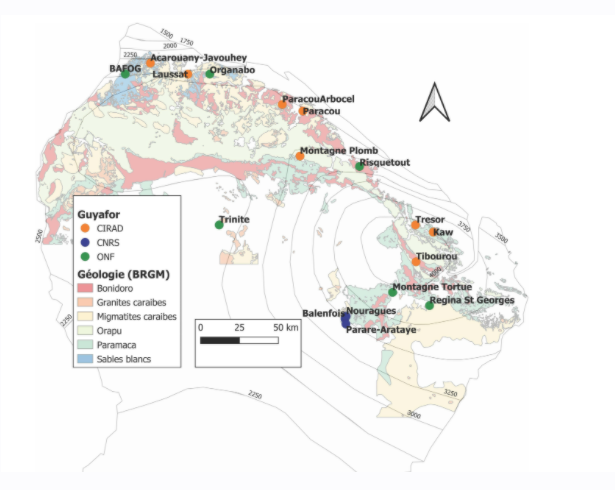
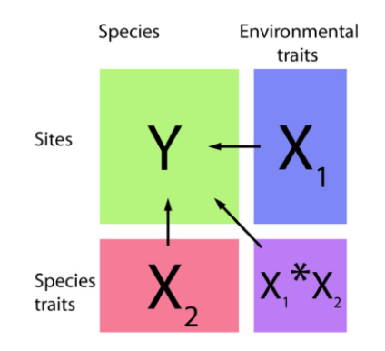

--- 
title: "Metradica"
author: "Marion Boisseaux"
date: "`r Sys.Date()`"
site: bookdown::bookdown_site
documentclass: book
bibliography: [book.bib, packages.bib]
# url: your book url like https://bookdown.org/yihui/bookdown
# cover-image: path to the social sharing image like images/cover.jpg
description: |
  This is a minimal example of using the bookdown package to write a book.
  The HTML output format for this example is bookdown::gitbook,
  set in the _output.yml file.
link-citations: yes
github-repo: mbthese/METRADICA
---

# About

*to describe*

<!--chapter:end:index.Rmd-->

# (PART) Part one: general introduction {-}

# Background 

* Tropical ecosystems, Amazon basin, focus on French Guiana 
* Threats : droughts 
* Trait-based ecology to define species strategies; a mechanistic understanding with hydraulic traits 


# Project introduction

My thesis is included in the METRADICA strategic project lead by Clement Stahl and Ghislain Vieilledent. **Mechanistic traits to predict shifts in tree species abundance and distribution with climate change in the Amazonian forest**. 

The global objectives of Metradica are to estimate species vulnerability to climate change and predict shifts in species distribution from species traits. 

It combines: current species distribution, hydrological indices, climatic predictions, and use a few key traits at the individual level in innovative models (joint species distribution model; JSDMs), in order to better understand the processes by which species interact with their environment.

There are 4 tasks : 
 
1. environmental index + species hydrological affinity 
2. species distribution + functional responses to env’t  
3. prediction of species distribution from traits using *four-corners* joint species distribution models 
4. shifts in species distribution through the lens of demographic process: interaction between models 

 

I am involved in task 2 : to acquire additional traits information in order to have an understanding of the environmental effect on intra- and inter- specific trait variability for morpho-anatomic and mechanistic traits at regional and local scales.

# Hypotheses 

**(1) Importance of local habitat in shaping functional strategies**

* Habitats are widely recognized to control trait variation 
* Identify species with statistically significant habitat associations
* Traits syndromes for specialists vs. generalists

*I will focus on topographic-driven variation in the water table, which is hypothesized to explain variation in forest responses to drought (Nobre et al.,2011) and species distribution (Schietti et al., 2014; Lourenço Jr. et al., 2021), where trees with higher hydraulic efficiency and drought sensitivity are mostly found in seasonally flooded habitats (Oliveira et al., 2019), which seems to buffer the impact of short-term droughts on Amazon forest survival and productivity (Esteban et al., 2020; Sousa et al., 2020).*


**(2) Patterns of functional responses to drought along a precipitation and topographic gradient**

* Explore how trait values vary across a precipitation gradient (Bafog “dry” to Kaw “wet”) 
* Are associations among traits consistent along the gradient in each habitat? Species should converge to a set of trait values that maximize their resource use efficiency. (Vleminckx et al 2021) 
* Identify species in their limit range regarding drought resistance. 

*shifts in trait variation across environmental gradients can provide powerful insights into the drivers of community assembly* (Junior et al 2021)

**(3) Evaluating the inter- and intra-specific variation of hydraulic and leaf traits**

Metradica data : exploring generalists species ITV (~60 individuals per species)
Hypothesis : because species' responses to the environment manifest through functional traits, the higher the ITV of a species is, the more diverse abiotic environments the species may be able to adapt to (Umaña et al., 2015).

<!--chapter:end:01-Introduction.Rmd-->

```{r , include=FALSE}
rm(list = ls()) ; invisible(gc()) ; set.seed(42)
library(knitr)
library(kableExtra)
if(knitr:::is_html_output()) options(knitr.table.format = "html") 
if(knitr:::is_latex_output()) options(knitr.table.format = "latex") 
library(tidyverse)
theme_set(bayesplot::theme_default())
knitr::opts_chunk$set(
	echo = F,
	fig.height = 6,
	fig.width = 8,
	message = FALSE,
	warning = FALSE,
	cache = TRUE,
	cache.lazy = F
)
```

# (PART) Part two : Materials & Method {-}
# Sampling

## Habitats

Two main forest habitats are present in French Guiana, *terra firme* (high clay content and high water drainage) and *seasonally flooded forests* (nutrient rich soils and at least 3 months of annual flooding) (INSERER BIBLIO Ferry, 2010). The water table is never observed to descend below 60 cm depth and remains at the soil surface for at least two consecutive months each year (Baraloto et al., 2007; Ferry et al., 2010).
During the field campaigns, we ensure that all trees sampled correspond to the correct habitat. In this case, any errors of habitat classification on the maps are being rectified. 

The habitat classification of the tree species are based on all the past project achieved.  

### Hydrological indexes

Topographic variables are strong proxies for soil hydrology, which correlates with a combination of physico-chemical properties. A new hydrological index that accounts for both variations in climate and soil / topography across sites by combining the concept of MCWD with the one of Relative Extractable Water (e.g. Wagner et al. 2011) or Plant Available Water capacity (Nepstad et al. 2004, Ouédraogo et al. 2016). For Paracou, there is the topography classification established by Allié, Pélissier et al., 2015. *Sylvain*: The topographic wetness index (𝑇𝑊𝐼), identifies water accumulation areas. TWI was derived from 185 a 1-m resolution digital elevation model built based on data from a LiDAR campaign done in 186 2015 using SAGA-GIS (Conrad et al. 2015).


### How do we define seasonally flooded soils? 

On maps, pixels located at an altitude difference of less than 2 m from the altitude of the nearest surface run-off of the same catchment area. *pixels situés à moins de 2m de dénivelé du plus proche écoulement de surface appartenant au même bassin versant*.  Surface run-off corresponds to pixels receiving the waterflow of at least 75 pixels upstream. Everything is being calculated from the SRTM 30 m (after adjusting the basin area with fillings.) 


Gaelle information: 

* utilisation couche sig onf
* critere pente (inf 20° = BF, pente moins forte espece de lissage avec bc d’arbres en BF, durcissement des criteres, affiner et bien tomber dans du BF) *comment:*  SRTM pente 20° à 30m ne correspond pas n’ont plus à la pente sur le terrain, il y a une imprecision. but again in natura we make sure the tree is really in the corresponding habitat.
* distance à la crique (inf 50m) (marginale)

 
The classification in the waterlogged habitat may be loose and not as precise as for the *terra firme*, but it does not impact the sampling. As we mentioned above, *in natura* we assess if the tree is really in a waterlogegd habitat or not.
 
## Sites

Permanent forest plots of the Guyafor network monitor since 1970 (Bafog, Paracou) individual tree growth and mortality in order to understand the different drivers of forest dynamics, including climate and disturbance. The network coves > 235 ha of tropical forest on 12 experimental sites. They are co-managed by the Cirad, CNRS and ONF institutes. METRADICA leaf samplings took place in the control plots. 



**Paracou **: 9 of these permanent forest plots were subjected to 3 different forest exploitation treatments. Out of 9, 3 plots served as control plots. In 1992, 3 additional biodiversity / control plots of 6.25 ha in size and one 25 ha plot were established. Within these plots all trees with a diameter at breast height (DBH) above 10 cm were mapped. Species richness at Paracou ranges between 150 and 200 species per hectare. Since the establishment of the permanent forest plots, tree inventories take place at Paracou, recording tree status (alive or dead) and the DBH to the nearest 0.5 cm. Samplings were done in plots 6, 11, 13, 14, 15, and 16 from the 23/10/2020-7/12/2020 and from 13/09/2021- 17/09/2021. 244 trees sampled but 240 individuals with values. Lost 4 individuals (bota error usually)


**Bafog**: 5 permanent plots monitored of the ONF institute. Samplings were done in plots 2, 3, 4, and 5 and off plots from the 1<sup>st</sup> to  16<sup>th</sup> of March 2021.  

**Est**: Samplings were done in plots KawGuyafor (1 ha) and Trésor from the 4<sup>th</sup> to  23<sup>rd</sup> of October 2021. Some trees were also sampled outside the plots. 

The three sites were chosen in order to sample species along the rainfall gradient. 


## Species

Specialist species are species that have a habitat preference, either for *terra firme* soils or for seasonally flooded soils in French Guiana. Generalist species are here defined as species able to thrive in the two contrasting habitats, they are regionally widespread and abundant species. 

We **hypothesize** that they should display large ITV since they inhabit a large ecological spectrum. We are interested to see how ITV of functional traits is structured for these generalist species. 

### Indicator Species Analysis

We explored the degree of habitat preference using **Indicator Species Analysis** (Dufrene & Legendre 1997). It takes account of both relative abundance and relative frequencies of each species across the two main habitats in French Guiana, seasonally flooded forest and Terra firme forests.

* Generalist:  IndVal ≠ 0 in the habitats (pVal>0.08 )
* Specialists:  IndVal > 0.24 in one habitat (pVal<0.08)

Species with high IndVals means that the species prefers the habitat (but not exclusive, hence the word **preference**), but are also a high probability of being sampled in the given habitat.

Our analysis identified 9 generalist taxa, 8 SFF specialist taxa and 7 terra firme specialist taxa.

### More details about IndVal

IndVal used by other projects (ex. INSERER BIBLIO TerSteege et al 2013). The relative abundance and the relative frequency must be combined by multiplication because they represent independent information about the species distribution. X100 for a percentage. The index is max when all individuals of a species are found in a single group of sites or when the species occurs in all sites of that group. The statistical significance of the species indicator values is evaluated using a randominization procedure. Significance of habitat association was estimated by a Monte Carlo procedure that reassigns species densities and frequencies to habitats 1000 times. It therefore gives an ecological meaning as it compares the typologies. 

Other indicators: 

* Contrary to **TWINSPAN**, this indicator index for a given species is independent of other species relative abundances and there is no need for pseudospecies
* Species richness (sensitive to several factors)
* Oliviera species association to the topographic and edaphic gradient : weighted the HAND or P concentration of the plot by the abundance of the species in the plot. Divided by the number of individuals of the species in all plots. 

### Chosen species 

Our analysis identified 9 generalist taxa, 8 SFF specialist taxa and 7 terra firme specialist taxa.

```{r echo=FALSE, message=FALSE, warning=FALSE}
library(readxl)
species <- read_excel("../Metradica_Paracou/Document/Totaux.xlsx", 
    sheet = "Feuil2")
library(kableExtra)
kable(species)


species <- data.frame(taxon = c(
  "Eperua_falcata", 
  "Iryanthera_hostmannii", 
  "Jacaranda_copaia subsp. copaia",
  "Pterocarpus_officinalis",
  "Symphonia_globulifera",
  "Tachigali_melinonii",
  "Virola_surinamensis", 
  "Bocoa_prouacensis",
  "Chrysophyllum_prieurii",
  "Conceveiba_guianensis",
  "Eschweilera_coriacea",
  "Hymenopus_heteromorphus",
  "Protium_stevensonii",
  "Virola_michelii",
  "Carapa_surinamensis",
  "Laetia_procera",
  "Protium_opacum",
  "Casearia_javitensis",
  "Dicorynia_guianensis",
  "Gustavia_hexapetala",
  "Iryanthera_sagotiana",
  "Licania_membranacea",
  "Poraqueiba_guianensis",
  "Vouacapoua_americana"
)) %>% 
  separate(taxon, c("Genus", "Species"), sep = "_", remove = F)
kable(select(species, Genus, Species), caption = "Studied species.")

```


Un espèce : bc mortlité chez les jeunes donc parti pris de les considerer dans le choix des habitats. (percentile 10-90). 
For *Eperua falcata*: BF?? see Laurens porter 2007 (are species adapted ...)

### Phylogeny


We also wanted to maximize the phylogeny to get a greater picture, having specialists and generalists in the main clades: (Rosids, Asterids, Magnoliids). This would allow us to assess whether the different strategies to drought tolerance can be extend to the species of the same clade.  

```{r echo=FALSE, fig.cap="phylogeny"}
library(V.PhyloMaker)
library(ggfortify)
library(tidyverse)
library(ggtree)
library(readxl)
species <- select(species, taxon , Genus, Species)
paracou <- read_excel("../Metradica_Paracou/Document/Paracou_database20210830.xlsx") %>% 
  dplyr::select(Family, Genus, Species) %>% 
  unique() %>% 
  full_join(species) %>% 
  mutate(species = paste(Genus, Species), genus = Genus, family = Family) %>% 
  dplyr::select(species, genus, family, taxon) %>% 
  mutate(taxon = as.character(taxon))
#tree <- phylo.maker(sp.list = paracou, tree = GBOTB.extended, nodes = nodes.info.1, scenarios = "S3")
#save(tree, file = "./document/phylogeny/phylogeny.Rdata")
load("Greenhouse_document/phylogeny/phylogeny.Rdata")
fortify(tree$scenario.3) %>% 
  mutate(species = gsub("_", " ", label)) %>% 
  left_join(paracou) %>% 
  ggtree(aes(col = taxon), layout="circular") + 
  geom_tiplab2(aes(alpha = !is.na(taxon), size = !is.na(taxon))) +
  theme_tree(legend.position='right', legend.text = element_text(face = "italic")) +
  scale_alpha_manual("taxon", values = c(0.2, 1)) +
  scale_size_manual("taxon", values = c(1, 2))
```


## Individuals

The individuals were selected with a DBH value between the 10<sup>th</sup> and the 90<sup>th</sup> percentile of the species' distribution pattern, in order to have a sampling that best reflects the forest structure. In this percentile interval, species were randomly selected for sampling. 

Sampling strategy :

* Maps were produced by QGIS software
* [**Field** protocol](../Metradica_Paracou/Document/Protocol/Field.Rmd)
* Fill the fieldworksheet [**Fieldworksheet**](../Metradica_Paracou/Document/Protocol/Feuille_terrain_releve.xlsx)
- [ ] Assess tree and branch height
- [ ] Assess tree and branch Dawkins : 

## Summary

* 2 habitats (Terra firme; Seasonally flooded soils)
* 24 species (9 generalists; 8 SFF; 7 TF)
* 10 individuals per species per site 
* 9 traits to investigate for drought tolerance

```{r echo=FALSE, message=FALSE, warning=FALSE}
library(readxl)
library(kableExtra)
library(ggplot2)
Sampling <- read_excel("../Metradica_Paracou/Document/Totaux.xlsx",  sheet = "Feuil1")
Sites <- c("Paracou", "FTH2021", "Bafog", "Kaw")
df = cbind(Sampling, Sites)


ggplot(df) +
  aes(x = sites, y = TreeSampled, fill = sites) +
  geom_bar(stat="identity") +
  labs(x = "sites", y = "TreeSampled") +
  theme_minimal() +
  theme(
    axis.title.y = element_text(face = "bold"),
    axis.title.x = element_text(face = "bold")
  )

Totaux <- read_excel("../Metradica_Paracou/Document/Totaux.xlsx", 
    sheet = "Feuil2")

Totaux  %>%
  kbl(caption = "Individuals per species collected on the 3 sites") %>%
  kable_classic(full_width = F, html_font = "Cambria")

```

<!--chapter:end:02-Sampling.Rmd-->

# Traits


This chapter defines measured and sampled traits with associated protocols.


## Morphological traits

* **LA**: leaf area $cm^{2}$ : carbo- acquisition related trait which informs on the light capture strategy. 
* **LDMC**: leaf dry matter content $mg.g^{-1}$ : a carbon-acquisition related trait which informs on the carbon investment in physical resistance and defense. 


## Hydraulic traits

* **RWC**: relative water content (%) is of special interest as it reflects the amount of water present the leaf relative to the maximum it can hold (*INSERER BIBLIO Barrs & Weatherley 1962*)
* **$\pi_{TLP}$**: leaf water potential at which leaf cells lose turgor (MPa), a key drought tolerance trait. 
* **$g_{min}$**: leaf minimum conductance $mmol.m^{-2}.s^{-1}$ taking into account water losses through the cuticle and incompletely closed stomata. A key drought-avoidance trait. 
* **Stomatal characteristics (size, density)**: morphological characteristic at the crossroads between water loss and the maximum rate of photosynthesis.(*INSERER BIBLIO Julio V. Schneider 2016*)
* **Nervation density**: determining the capacity of water supply in leaves. (*INSERER BIBLIO Julio V. Schneider 2016*)
* **Leaf chemistry** : To assess the leaves' concentration in carbon, nitrogen and phosphorous.
* **P<sub>midday</sub>**: Water potential at the driest point of the day. 
* **$\delta$ <sup>18</sup> O and $\delta$ <sup>13</sup> C** : Informs patterns of carbon and water use, related to water use efficiency. (*INSERER BIBLIO Farquhar et al 1989*) Measured in Vienna.


## Photochemical trait
 
* **$\frac{Fv}{Fm}$**: maximum quantum yield of photosystem II, which reflects photosynthesis efficiency ($\mu mol . m^{-2} . s^{-1}/ \mu mol . m^{-2} . s^{-1}$). It is an indicator of photosynthetic performance, as it has been shown to be sensitive to drought constraints in tropical forests (*INSERER BIBLIO Manzi et al 2021*) but decline after other leaf hydraulic traits (*INSERER BIBLIO Trueba et al 2019*).


## Measured traits

* Day 1
    * Fresh
        * On field: P<sub>midday</sub>
        * scan gmin leaves
        * fresh weight RWC 
        * **$g_{min}$** weight  
        * **Stomatal density** nail polish (3 replicates per indivual)
        * **$\frac{Fv}{Fm}$**
    
    * Day 2
        * saturated weight RWC
        * **$g_{min}$** finish weights (at least 2 points next day)
        * **$\pi_{TLP}$**
    
    * Day 5 (+72h)
        * Dry weight RWC
        
* Later on :
    * Stomatal observation and density counts 
    * Measure of vein densities 
    * Chemistry of dry-grinded leaves

## Protocols

* [**Field** protocol](../Metradica_Paracou/Document/Protocol/Field.Rmd)
* [**$\pi_{TLP}$** protocol](../Metradica_Paracou/Document/Protocol/Protocole_Ptlp.pdf)
* [**RWC** protocol](../Metradica_Paracou/Document/Protocol/RWC_Boisseaux.docx)
* [**Stomata** protocol](../Metradica_Paracou/Document/Protocol/Analyse Stomates_Marion.docx)
* [**FvFm** protocol](../Metradica_Paracou/Document/Protocol/Fluo_Bellifa.docx)
* [**gmin** protocol](../Metradica_Paracou/Document/Protocol/Gmin protocol.docx)
* [**leaf venation** protocol](../Metradica_Paracou/Document/Protocol/ProtocolLeafVeins_MB_2.docx) 

<!--chapter:end:03-Traits.Rmd-->

```{r setupvarpart, include=FALSE}
rm(list = ls()) ; invisible(gc()) ; set.seed(42)
library(knitr)
library(kableExtra)
if(knitr:::is_html_output()) options(knitr.table.format = "html") 
if(knitr:::is_latex_output()) options(knitr.table.format = "latex") 
library(tidyverse)
theme_set(bayesplot::theme_default())
knitr::opts_chunk$set(
	echo = F,
	fig.height = 6,
	fig.width = 8,
	message = FALSE,
	warning = FALSE,
	cache = TRUE,
	cache.lazy = F
)
```

# (PART) Part three : Results {-}

# Trait distribution

A focus on the frequency distribution of traits of individuals within communities allows scaling up from organism to ecosystem level and assessing how ecological communities and ecosystems respond to climate drivers (Garnier et al 2016; Liu et al 2020).

The shape of trait distribution could have the potential to reveal the ecological significance of trends and tradeoffs in traits at the species level. A focus on the *mean * and the *variance* of the community trait distribution is rooted in the 
concept of phenotype-environment matching and environmental optimality, where species’ relative abundance is mediated by their traits, that is, “community assembly by trait selection”. To understand how community trait composition is affected by ecological processes. 

* use of community-weighted trait metrics CWM
* variance
* mean
* skewness (symmetry)
* kurtosis (measure of tailness with heavy tail referring to outliers)

Hypotheses : 

Part I (Habitat-Paracou) : *specialists* species should have a more adequate set of trait to a given habitat than the generalists in the same habitat.


# PCA results

The aim is to define a set of key traits that together explain why a species would be specialist or generalist. 

Generalist species should display a greater degree of intraspecific variability in traits related to habitat use than specialists because they experience a wider range of environmental conditions and/or have inherently higher levels of phenotypic plasticity.

Here is an analysis aimed to explore co-variations of individual traits. Specifically, I investigated individual traits co-variation at two taxonomic scales: among species, and within species.

# Trait covariation

- Clean dataset

```{r echo=FALSE, message=FALSE, warning=FALSE}
Traits <- read.csv("C:/Users/marion.boisseaux/Dropbox/Mon PC (Jaboty20)/Documents/METRADICA/Metradica_Paracou/Rawdata/Donnees_clean/Traits_Paracou.csv", header=TRUE)

head(Traits)

```


We aimed to explore co-variations of leaf traits belonging to 244 individuals from 24 species. We investigated trait co-variation at 2 taxonomic scales: (i) between species, (ii) within species between individuals.


Between all species, **26.34%** of the total variance was conserved on the two first axes from the PCA of the traits. The *first axis opposed SLA to CC and LT, from high SLA leaves to thick leaves rich in chlorophyll, whereas the second axis is related to LA and LDMC, increasing with leaf area and dry matter. The first axis highlighted a correlation between CC and LT. SLA and LA decoupled relation is enlightened within the PCA plane. Moreover for the two complexes, we observed a general trend of diameters distribution along the first PCA axis. Smaller diameter seemed linked to thinner leaves with increased SLA and less chlorophyll. Besides both axes showed significative complex segregation ($p-value < 0.0001$), the second PCA axis segregated the two complexes with no overlap.*
Les 2 premiers axes de l' analyse expriment **26.34%** de l'inertie totale du jeu de données ; cela signifie que 26.34% de la variabilité totale du nuage des individus (ou des variables) est représentée dans ce plan.
C'est un pourcentage relativement faible, et le premier plan ne représente donc seulement qu'une part de la variabilité contenue dans l'ensemble du jeu de données actif.
Cette valeur est supérieure à la valeur référence de **14.1%**, la variabilité expliquée par ce plan est donc significative
(cette intertie de référence est le quantile 0.95-quantile de la distribution des pourcentages d'inertie obtenue en simulant 2209 jeux de données aléatoires de dimensions comparables sur la base d'une distribution normale).

Du fait de ces observations, il serait alors très probablement nécessaire de considérer également les dimensions supérieures ou égales à la troisième  dans l'analyse.

<!--chapter:end:04-Results.Rmd-->

---
title: "Results_bis"
author: "Marion Boisseaux"
date: "01/02/2022"
output: html_document
editor_options: 
  chunk_output_type: inline
---

# To do 


What is missing:
* stomatal densities
* FTH data
* vein densities 
* check gmin function 
* check for outliers -> see Daniela

# Import Paracou dataset


```{r Paracou2020}
library(readr)
library(readr)
Paracou <- read_csv("C:/Users/marion.boisseaux/Dropbox/Mon PC (Jaboty20)/Documents/METRADICA/Metradica_Paracou/Rawdata/Donnees_clean/Traits_Paracou.csv")


FTH2021 <- read_csv("C:/Users/marion.boisseaux/Dropbox/Mon PC (Jaboty20)/Documents/METRADICA/Metradica_Paracou/Rawdata/Donnees_clean/FTHdata2021.csv")

```

```{r FTH2021}
library(readxl)
library(googlesheets4)
library(dplyr)

HydroITV_individuals <- googlesheets4::read_sheet("https://docs.google.com/spreadsheets/d/1-INnZ563VkNBH8rnSwfWieuGwPo9x9GRSV6jXNzatmM/edit#gid=0", range = "individuals")

HydroITV_traits <- googlesheets4::read_sheet("https://docs.google.com/spreadsheets/d/1-INnZ563VkNBH8rnSwfWieuGwPo9x9GRSV6jXNzatmM/edit#gid=0", range = "ind_ft")

HydroITV_traits <- rename(HydroITV_traits, FieldCode = Individual)

HydroITV <- filter(HydroITV_individuals, StudyLevel == "tree")

All_HydroITV_indv <- left_join(HydroITV, HydroITV_traits, by = "FieldCode")

Gmin_MB_corr_FTH <- read_excel("C:/Users/marion.boisseaux/Dropbox/Mon PC (Jaboty20)/Documents/METRADICA/Metradica_Paracou/Document/Gmin_MB_corr_FTH.xls", 
    sheet = "Gmin_20210920")

Metradica_individuals <- read_excel("C:/Users/marion.boisseaux/Dropbox/Mon PC (Jaboty20)/Documents/METRADICA/Metradica_Paracou/Document/FTH2021.xlsx", 
    sheet = "metradica")

FTHdata2021 <- left_join( Metradica_individuals, All_HydroITV_indv, by = "TreeFieldNum")

library(rio)
export(FTHdata2021, "FTHdata2021.csv")
```

il manque encore les quelques individus résoltés avec Sylvain dans les indv de Paracou.


```{r Merge Paracou data}
library(dplyr)
library(tidyr)
value <- c(245:260)

A <- full_join(Paracou, FTH2021)
A <- A %>% complete(Code, fill = list(245:260))


```

```{r Daniela}
library(readr)
library(dplyr)
ParacouIndv <- read_csv("C:/Users/marion.boisseaux/Dropbox/Mon PC (Jaboty20)/Documents/METRADICA/Metradica_Paracou/Rawdata/FieldSheet_Clean_OUT_Metradica.csv")
ParacouTraits <- read_csv("C:/Users/marion.boisseaux/Dropbox/Mon PC (Jaboty20)/Documents/METRADICA/Metradica_Paracou/Rawdata/Metradica_Individual_based_Trait_Data_including_replications.csv")

Paracou <- left_join(ParacouIndv, ParacouTraits, by = 'idTree')

Paracou 


```

```{r ptlp}
#ANOVA Camille

#the p-value for one-way ANOVA is less than 0.05 indicates that at least one of the  groups differens from the others. 


library(readxl)
library(tidyverse)
library(ggpubr)
library(rstatix)
library(rstatix)

data <- Paracou

data$Habitat_real<- as.factor(data$Habitat_real)
data$Habitat_preference<-as.factor(data$Habitat_preference)
data$SpecCode_CorrBota<-as.factor(data$SpecCode_CorrBota)
data$My_ptlp<- log(-data$My_ptlp)

#quel type ANOVA? Type I or type II c'est les statistiqus utilisées à l'interieur de l'ANOVA. type II par defaut. 
#anova = comparaison de moyennes qui sont calculés grace à des modèles lineaires

# dire quel est mon modele linaire : souvent c'est lm, le basique de R

modele1 <- lm(My_ptlp~Habitat_preference+Habitat_real, data=data) #sans les interactions. mais sinon la reponse à l'habitat de preference en fonction des espèces on rajoute ":" ou "*" à verifier . * est un raccourci a*b c'est a+b+a:b. c'est à dire comme ca:


modele4<- lm(My_ptlp~Habitat_real, data=data)#pour voir l'effet des sous blocs, des traitements, traitements n fonciton espèce, et espèce.


summary(modele4)
summary(modele1) # dans les coef, mon traitement C0 est mon traitement de reference. A voir comment le faire manuellement si jamais ca change. et mes estimates des treatment D1,D2,D3 sont des valeurs qui s'ajoutent ou s'enlèvent par rapport à la reference. 

plot(modele4)
#pour quantifier et pas juste regarder graphiquement: shapiro-wilk (normalité des residus) et test de levene ou test de bartlett (pour l'homoskedasticity: homogeneité des variances) parce que c'est les hypotheses du modele lineaire qui on a dit : N(0,sigma).le mieux pour pas se prendre la tete : faire representation graphique, un histogram des residus et on regarde si c'est une gaussienne.

hist(modele4$residuals)
#apres les summary, il faut tester la distribution qui doit etre normale pour les résidus. 
# Create a QQ plot of residuals
ggqqplot(residuals(modele4))

# Compute Shapiro-Wilk test of normality, to see if follows normal distribution or not/ the Shapiro-Wilk test did not show evidence of non-normality if p >0.05. (we have 0.0961)
shapiro_test(residuals(modele4))

ggqqplot(data, "My_ptlp", facet.by = "Habitat_real")#il se passe un truc bizarre sur les ptlp de BF


#homogeneity of variance across groups.The p-value of the test is 0.0546, which is more than our significance level of 0.05. Thus, we cannot reject the null hypothesis and conclude that the variance among the three groups is equal.
data %>% levene_test(My_ptlp ~ Habitat_real)
bartlett.test(My_ptlp ~ Habitat_real, data = data)#p-value = 0.1133 less than 0.05 the assumption of equal variances is violated and we can proceed to perform Welch’s ANOVA.


#homogeneity of variance assumption is not met, you can compute the Welch one-way ANOVA test using the function welch_anova_test()[rstatix package]. This test does not require the assumption of equal variances.

#plusieurs manieres de faire une ANOVA

data %>% welch_anova_test(My_ptlp~ Habitat_real) 

#The overall p-value (.135) from the ANOVA table is more than α = .05, which means we cannot reject the null hypothesis that the ptlp values are equal between the 2 habitats.


```

```{r gmin}
#ANOVA Camille

#the p-value for one-way ANOVA is less than 0.05 indicates that at least one of the  groups differens from the others. 


library(readxl)
library(tidyverse)
library(ggpubr)
library(rstatix)
library(rstatix)

data <- Paracou

data$Habitat_real<- as.factor(data$Habitat_real)
data$Habitat_preference<-as.factor(data$Habitat_preference)
data$SpecCode_CorrBota<-as.factor(data$SpecCode_CorrBota)


#quel type ANOVA? Type I or type II c'est les statistiqus utilisées à l'interieur de l'ANOVA. type II par defaut. 
#anova = comparaison de moyennes qui sont calculés grace à des modèles lineaires

# dire quel est mon modele linaire : souvent c'est lm, le basique de R

modele1 <- lm(My_gmin.slope~Habitat_preference+Habitat_real, data=data) #sans les interactions. mais sinon la reponse à l'habitat de preference en fonction des espèces on rajoute ":" ou "*" à verifier . * est un raccourci a*b c'est a+b+a:b. c'est à dire comme ca:


modele4<- lm(My_gmin.slope~Habitat_real, data=data)#pour voir l'effet des sous blocs, des traitements, traitements n fonciton espèce, et espèce.


summary(modele4)
summary(modele1) # dans les coef, mon traitement C0 est mon traitement de reference. A voir comment le faire manuellement si jamais ca change. et mes estimates des treatment D1,D2,D3 sont des valeurs qui s'ajoutent ou s'enlèvent par rapport à la reference. 

plot(modele4)
#pour quantifier et pas juste regarder graphiquement: shapiro-wilk (normalité des residus) et test de levene ou test de bartlett (pour l'homoskedasticity: homogeneité des variances) parce que c'est les hypotheses du modele lineaire qui on a dit : N(0,sigma).le mieux pour pas se prendre la tete : faire representation graphique, un histogram des residus et on regarde si c'est une gaussienne.

hist(modele4$residuals)
#apres les summary, il faut tester la distribution qui doit etre normale pour les résidus. 
# Create a QQ plot of residuals
ggqqplot(residuals(modele4))

# Compute Shapiro-Wilk test of normality, to see if follows normal distribution or not/ the Shapiro-Wilk test did not show evidence of non-normality if p >0.05. (we have 0.0961)
shapiro_test(residuals(modele4))

ggqqplot(data, "My_gmin.slope", facet.by = "Habitat_real")#il se passe un truc bizarre sur les ptlp de BF


#homogeneity of variance across groups.The p-value of the test is 0.0546, which is more than our significance level of 0.05. Thus, we cannot reject the null hypothesis and conclude that the variance among the three groups is equal.
data %>% levene_test(My_gmin.slope ~ Habitat_real)
bartlett.test(My_gmin.slope ~ Habitat_real, data = data)#p-value = 0.1133 more than 0.05 the assumption of equal variances is violated and we can proceed to perform Welch’s ANOVA.


#homogeneity of variance assumption is not met, you can compute the Welch one-way ANOVA test using the function welch_anova_test()[rstatix package]. This test does not require the assumption of equal variances.

#plusieurs manieres de faire une ANOVA

data %>% welch_anova_test(My_gmin.slope~ Habitat_real) 

#The overall p-value (0.067) from the ANOVA table is more than α = .05, which means we cannot reject the null hypothesis that the gmin values are equal between the 2 habitats.

```

```{r}
#ANOVA Camille

#the p-value for one-way ANOVA is less than 0.05 indicates that at least one of the  groups differens from the others. 


library(readxl)
library(tidyverse)
library(ggpubr)
library(rstatix)
library(rstatix)

data <- Paracou

data$Habitat_real<- as.factor(data$Habitat_real)
data$Habitat_preference<-as.factor(data$Habitat_preference)
data$SpecCode_CorrBota<-as.factor(data$SpecCode_CorrBota)
data$My_LSWC_E.per_corr=log(data$My_LSWC_E.per_corr)
data <- rename(data, LSWC = My_LSWC_E.per_corr)


#quel type ANOVA? Type I or type II c'est les statistiqus utilisées à l'interieur de l'ANOVA. type II par defaut. 
#anova = comparaison de moyennes qui sont calculés grace à des modèles lineaires

# dire quel est mon modele linaire : souvent c'est lm, le basique de R

modele1 <- lm(LSWC~Habitat_preference+Habitat_real, data=data) #sans les interactions. mais sinon la reponse à l'habitat de preference en fonction des espèces on rajoute ":" ou "*" à verifier . * est un raccourci a*b c'est a+b+a:b. c'est à dire comme ca:


modele4<- lm(LSWC~Habitat_real, data=data)#pour voir l'effet des sous blocs, des traitements, traitements n fonciton espèce, et espèce.


summary(modele4)
summary(modele1) # dans les coef, mon traitement C0 est mon traitement de reference. A voir comment le faire manuellement si jamais ca change. et mes estimates des treatment D1,D2,D3 sont des valeurs qui s'ajoutent ou s'enlèvent par rapport à la reference. 

plot(modele4)
#pour quantifier et pas juste regarder graphiquement: shapiro-wilk (normalité des residus) et test de levene ou test de bartlett (pour l'homoskedasticity: homogeneité des variances) parce que c'est les hypotheses du modele lineaire qui on a dit : N(0,sigma).le mieux pour pas se prendre la tete : faire representation graphique, un histogram des residus et on regarde si c'est une gaussienne.

hist(modele4$residuals)
#apres les summary, il faut tester la distribution qui doit etre normale pour les résidus. 
# Create a QQ plot of residuals
ggqqplot(residuals(modele4))

# Compute Shapiro-Wilk test of normality, to see if follows normal distribution or not/ the Shapiro-Wilk test did not show evidence of non-normality if p >0.05. (we have 0.0961)
shapiro_test(residuals(modele4))

ggqqplot(data, "LSWC", facet.by = "Habitat_real")#il se passe un truc bizarre sur les ptlp de BF


#homogeneity of variance across groups.The p-value of the test is 0.0546, which is more than our significance level of 0.05. Thus, we cannot reject the null hypothesis and conclude that the variance among the three groups is equal.
data %>% levene_test(LSWC ~ Habitat_real)
bartlett.test(LSWC ~ Habitat_real, data = data)#p-value = 0.1133 more than 0.05 the assumption of equal variances is violated and we can proceed to perform Welch’s ANOVA.


#homogeneity of variance assumption is not met, you can compute the Welch one-way ANOVA test using the function welch_anova_test()[rstatix package]. This test does not require the assumption of equal variances.

#plusieurs manieres de faire une ANOVA

data %>% welch_anova_test(LSWC~ Habitat_real) 

#The overall p-value (0.067) from the ANOVA table is more than α = .05, which means we cannot reject the null hypothesis that the gmin values are equal between the 2 habitats.
```

```{r}

library(mvnormtest)
library(dplyr)
library(tidyverse)
data <- Paracou

data <- mutate(data, LSWC = log(data$My_LSWC_E.per_corr))
data <- mutate(data, Ptlp = log(-My_ptlp))
data <- mutate(data, gmin = log(My_gmin.slope))
data <- mutate(data, vein= log(Trait_Major_VD))

data$Habitat_real<- as.factor(data$Habitat_real)
data$Habitat_preference<-as.factor(data$Habitat_preference)
data$SpecCode_CorrBota<-as.factor(data$SpecCode_CorrBota)

gmin <- data$gmin
LSWC <- data$LSWC
vein <- data$vein
ptlp <- data$Ptlp

# MANOVA test
res.man <- manova(cbind(gmin, Ptlp, LSWC, vein) ~ SpecCode_CorrBota, data = data)
summary(res.man)

#used a MANOVA to test for multivariate differences between habitat and species identity. 
#used Mantel tests to evaluate whether matrices of pairwise correlations between all traits were similar among forest habitatsthe twenty four focal tree species.


library(ggplot2)
library(multcompView)
Paracou<- na.omit(Paracou) 

p <- ggplot(Paracou) +
 aes(x = Habitat_preference, y = My_ptlp, fill = Habitat_preference, group = Habitat_preference) +
 geom_boxplot(shape = "circle") +
 scale_fill_manual(values = list(BF = "#8489F4", Generalist = "#9FFB81", 
 TF = "#FFAB61")) +
 labs(y = "Ptlp (MPa)") +
 theme_minimal()+
  theme(axis.title.x=element_blank(),
        axis.text.x=element_blank(), axis.title.y=element_text(size=20,face="bold"))

#p<-p + stat_compare_means(method = "kruskal.test", aes(label = ..p.signif..),                       label.x = 1.5, label.y = -1)
p<-cld_bxplot_wilcox(Paracou,x=Paracou$Habitat_preference,y=Paracou$My_ptlp,plot = p,nudge = 1)

g <- ggplot(Paracou) +
 aes(x = Habitat_preference, y = My_gmin.slope, fill = Habitat_preference, group = Habitat_preference) +
 geom_boxplot(shape = "circle") +
 scale_fill_manual(values = list(BF = "#8489F4", Generalist = "#9FFB81", 
 TF = "#FFAB61")) +
 labs( y = "gmin (mmol.m-2.s-1)") +
 theme_minimal()+
    theme(axis.title.x=element_blank(),
        axis.text.x=element_blank(), axis.title.y=element_text(size=20,face="bold"))
#g<-g + stat_compare_means(method = "kruskal.test", aes(label = ..p.signif..),  label.x = 1.5, label.y = 10)
g<-cld_bxplot_wilcox(Paracou,x=Paracou$Habitat_preference,y=Paracou$My_gmin.slope,plot = g,nudge = 1)


l <- ggplot(Paracou) +
 aes(x = Habitat_preference, y = My_LSWC_E.per_corr, fill = Habitat_preference, group = Habitat_preference) +
 geom_boxplot(shape = "circle") +
 scale_fill_manual(values = list(BF = "#8489F4", Generalist = "#9FFB81", 
 TF = "#FFAB61")) +
 labs( y = "LSWC (g.g-1)") +
 theme_minimal()+
    theme(axis.title.x=element_blank(),
        axis.text.x=element_blank(), axis.title.y=element_text(size=20,face="bold"))
#l<-l + stat_compare_means(method = "kruskal.test", aes(label = ..p.signif..), label.x = 1.5, label.y = 40)

l<-cld_bxplot_wilcox(Paracou,x=Paracou$Habitat_preference,y=Paracou$My_LSWC_E.per_corr,plot = l,nudge = 1)

v <- ggplot(Paracou) +
 aes(x = Habitat_preference, y = Trait_Major_VD, fill = Habitat_preference, group = Habitat_preference) +
 geom_boxplot(shape = "circle") +
 scale_fill_manual(values = list(BF = "#8489F4", Generalist = "#9FFB81", 
 TF = "#FFAB61")) +
 labs( y = "Major vein density (mm.mm-2)") +
 theme_minimal()+
   theme(axis.title.x=element_blank(),
        axis.text.x=element_blank(), axis.title.y=element_text(size=20,face="bold"))
#v + stat_compare_means(method = "kruskal.test", aes(label = ..p.signif..),         label.x = 1.5, label.y = 1.5)

v<- cld_bxplot_wilcox(Paracou,x=Paracou$Habitat_preference,y=Paracou$Trait_Major_VD,plot = v,nudge = 1)


l2 <- ggplot(Paracou) +
 aes(x = spName_CorrBota.x, y = My_LSWC_E.per_corr, fill = Habitat_real, group = Habitat_real) + scale_fill_manual(values = list(BF = "#8489F4", 
 TF = "#FFAB61")) +
 geom_boxplot(shape = "circle") +
 theme_minimal()+
labs(x = "Species", y = "LSWC")
l2 + stat_compare_means(method = "anova", aes(label = ..p.signif..), 
                        label.x = 1.5, label.y = 40)
g2 <- ggplot(Paracou) +
 aes(x = spName_CorrBota.x, y = My_gmin.slope, fill = Habitat_real, group = Habitat_real) + scale_fill_manual(values = list(BF = "#8489F4", 
 TF = "#FFAB61")) +
 geom_boxplot(shape = "circle") +
 theme_minimal()+
labs(x = "Species", y = "gmin")
g2 + stat_compare_means(method = "anova", aes(label = ..p.signif..), 
                        label.x = 1.5, label.y = 40)
p2 <- ggplot(Paracou) +
 aes(x = spName_CorrBota.x, y = My_ptlp, fill = Habitat_real, group = Habitat_real) + scale_fill_manual(values = list(BF = "#8489F4", 
 TF = "#FFAB61")) +
 geom_boxplot(shape = "circle") +
 theme_minimal()+
labs(x = "Species", y = "Ptlp")
p2 + stat_compare_means(method = "anova", aes(label = ..p.signif..), 
                        label.x = 1.5, label.y = 40)


v2 <- ggplot(Paracou) +
 aes(x = spName_CorrBota.x, y = Trait_Major_VD, fill = Habitat_real, group = Habitat_real) + scale_fill_manual(values = list(BF = "#8489F4", 
 TF = "#FFAB61")) +
 geom_boxplot(shape = "circle") +
 theme_minimal()+
labs(x = "Species", y = "major veins (1st, 2nd, 3rd)")
v2 + stat_compare_means(method = "anova", aes(label = ..p.signif..), 
                        label.x = 1.5, label.y = 40)

library(ggplot2)
library(cowplot)

plot_grid(p, l, g, v, labels = c('A', 'B', 'C', 'D'), label_size = 12)


library(ggpubr)

a<-ggarrange(p, l, g, v,
align='h', labels=c('A', 'B','C','D'),
common.legend = T,
 legend = "right")
```

```{r}
library(FactoMineR)
library(factoextra)
library(Factoshiny)
library(ggplot2)

ggplot(Paracou) +
 aes(x = RWCnr_original, y = My_ptlp, fill = Tree_Dawkins, group = Tree_Dawkins) +
 geom_boxplot(shape = "circle") +
 scale_fill_gradient() +
 theme_minimal()


```


<!--chapter:end:05-Results_PARACOU.Rmd-->

---
title: "Venation results"
author: "Marion Boisseaux"
date: "28/03/2022"
output: html_document
---
# Vein traits

The leaf is a critical component in the plant water transport system, accounting for 30% or more of whole-plant hydraulic resistance (Sack and Holbrook, 2006). Leaf venation architecture has numerous common functions across plant species—see Sack & Scoffoni, 2013 for review. Briefly, the leaf venation serves for mechanical support (Niklas, 1999), sugar and hormone transport in the phloem (Kehr & Buhtz, 2008), and, via the xylem, the replacement of water lost to transpiration when the stomata open for photosynthesis (Sack & Holbrook, 2006). However, venation architecture is highly diverse across species (Uhl & Mosbrugger, 1999; Roth-Nebelsick et al., 2001; Sack & Frole, 2006; Ellis et al., 2009; Brodribb et al., 2010). In dicotyledons, the leaf venation system typically consists of three orders of major veins and up to five higher orders of minor veins embedded in the mesophyll, with the vein orders arranged in a hierarchy; lower order veins are larger in diameter, with greater xylem conduit numbers and sizes, whereas higher order veins have greater length per leaf area (VLA; Sack & Holbrook, 2006; McKown et al., 2010). Total leaf VLA has been shown to correlate with maximum hydraulic conductance and photosynthetic rate per area across species (Sack & Frole, 2006; Brodribb et al., 2007) and tends to be higher for species growing in high light. Major VLA has been found to play a role in determining the damage tolerance of the vein system, and in leaf drought tolerance (Sack et al., 2008; Scoffoni et al., 2011). 


## Hypothesis

- Smaller leaves tend to have a higher major VLA. For SFF specialists, the replacement of water lost to transpiration during photosynthesis would be no problem during the wet season, since water is not a limiting factor. We collected the leaves during the dry season, therefore, SFF specialists would either have an adapted mechanisms to overcome water scarcity or not. 
- Leaves from the driest habitat, *Terra firme* are smaller and have a higher major VLA than the leaves from seasonally flooded habitats. 
- Leaves from Bafog (lower precipitation regime) are smaller with a higher major VLA than leaves in Kaw (higher precipitation regime). Paracou leaves major VLA values would range in the middle. 

Litterature :

*Smaller leaves tend to have higher major VLA intrinsically as a result of their development. The drought tolerance and protection conferred by higher major VLA in smaller leaves provides an explanation for the greater abundance of smaller leaves in drier and more exposed habitats (Scoffoni et al., 2011).*

*Drought impacts less leaves with higher major vein density because they can provide more numerous water flow pathways around the damaged vein. (Scoffoni et al 2011)*

*Smaller leaves, which generally have higher major vein density, would thus have lower hydraulic vulnerability. Tests using simulations with a spatially explicit model confirmed that smaller leaves with higher major vein density were more tolerant of major vein embolism.(Scoffoni et al 2011)*

From Scoffoni *et al* 2011:

* Smaller leaves more frequent in dry habitats
* Smaller leaves have thinner boundary layer: more rapid convective cooling  
* Direct hydraulic benefit of small leaves, if their greater major vein redundancy protects K  leaf from decline and thus contributes to drought tolerance.

## Materials and Method

Leaf area (LA, mm2 ) 
Major vein density (Major VLA, mm/mm2) : vein length per unit area 
Sum of vein densities for 1°, 2° and 3° veins (mm mm-2)
Double sided lamp flatbed scanner
ImageJ


*Why a higher VLA? To confer redundancy and drought tolerance*

Measurements from Scoffoni's Lab. These measures were calculated by a student group project from January - March 2022.

## Statistical analysis

* ANOVAs for the differences between SFF and TF habitat 
* ANOVAs for the differences between the three sites
* ANOVAs for the differences between habitat specialists and generalists
Species nested within those categories

Additional data to confront VLA with :

* Ptlp 
    + hypotheses : Species of TF habitat would exhibit greater expression of leaf drought tolerance traits than species from SFF habitat i.e. small leaves with high VLA associated with more negative values for osmotic potential at at turgor loss point.
- gmin (same VLA leaf)
    + Species of TF habitat would exhibit greater expression of leaf drought tolerance traits than species from SFF habitat i.e. small leaves with high VLA associated with lower minimal cuticular conductance. 
- LSWC 
    + Species of TF habitat would exhibit greater expression of leaf drought tolerance traits than species from SFF habitat i.e. small leaves with high VLA associated with higher LSWC more water per unit dry weight, that would provide a larger buffering capacity when water supply becomes limiting (higher water storage)
- Stomatal density *waiting for data*
- leaf chemistry *waiting for data*

Paracou data: 
```{r}

```

Bafog data: 
Kaw data: 

## Results

```{r Import dataset veins, include=FALSE}
library(readxl)
library(forcats)
library(dplyr)
library(tidyverse)


veindata <- read_excel("C:/Users/marion.boisseaux/Dropbox/Mon PC (Jaboty20)/Documents/METRADICA/Divers/Scoffoni/results/summarize_spp_avg.xlsx",     sheet = "for R")

veindata <- veindata %>%
    mutate(Species = recode(Species, 'Protium_picramnioides' = 'Protium_stevensonii')) %>%
    mutate(Species = recode(Species, 'Jacaranda_copaia' = 'Jacaranda_copaia subsp. Copaia'))


veindata$Species <- as.factor(veindata$Species)
fct_reorder(veindata$Species, veindata$LA, min)

veindata$MajVLA <- as.numeric(veindata$MajVLA)

```

### Across species from all habitats

```{r echo=FALSE}
library(ggplot2)
library(forcats)
library(dplyr)
library(tidyverse)


ggplot(veindata) +
 aes(x = fct_reorder(Species, LA), y = LA, fill = Species) +
 geom_boxplot(shape = "circle") +
 theme_minimal() + 
 facet_grid(vars(Site), vars()) + 
theme(axis.text.x = element_text(angle = 90, vjust = 0.5, hjust=1))


ggplot(veindata) +
 aes(x = fct_reorder(Species, MajVLA), y = MajVLA, fill = Species) +
 geom_boxplot(shape = "circle") +
 theme_minimal() + 
 facet_grid(vars(Site), vars()) + 
theme(axis.text.x = element_text(angle = 90, vjust = 0.5, hjust=1))


```


### SFF vs TF habitats

```{r echo=FALSE}

library(ggplot2)

ggplot(veindata) +
 aes(x = Habitat, y = LA, fill = Habitat) +
 geom_boxplot(shape = "circle") +
 scale_fill_manual(values = list(
 BF = "#6DB9F8", TF = "#FFA961")) +
 theme_minimal() +
 theme(plot.subtitle = element_text(size = 15L), 
 plot.caption = element_text(size = 14L), axis.title.y = element_text(size = 14L), axis.title.x = element_text(size = 18L)) +
 facet_wrap(vars(Site))


ggplot(veindata) +
 aes(x = Habitat, y = MajVLA, fill = Habitat) +
 geom_boxplot(shape = "circle") +
 scale_fill_manual(values = list(
 BF = "#6DB9F8", TF = "#FFA961")) +
 theme_minimal() +
 theme(plot.subtitle = element_text(size = 15L), 
 plot.caption = element_text(size = 14L), axis.title.y = element_text(size = 14L), axis.title.x = element_text(size = 18L)) +
 facet_wrap(vars(Site))

```


### Specialists SFF vs Specialists TF vs Generalists


```{r echo=FALSE}

library(ggplot2)
ggplot(veindata) +
 aes(x = Pref_Habitat, y = LA, fill = Pref_Habitat) +
 geom_boxplot(shape = "circle") +
 scale_fill_manual(values = list(BF = "#495BE3", Generalist = "#AED3CC", TF = "#F0C323")) +
 theme_minimal() +
 facet_wrap(vars(Site))

ggplot(veindata) +
 aes(x = Pref_Habitat, y = MajVLA, fill = Pref_Habitat) +
 geom_boxplot(shape = "circle") +
 scale_fill_manual(values = list(BF = "#495BE3", Generalist = "#AED3CC", TF = "#F0C323")) +
 theme_minimal() +
 facet_wrap(vars(Site))


```


### Bafog vs Kaw
```{r echo=FALSE}
library(ggplot2)

ggplot(veindata) +
 aes(x = Site, y = LA, fill = Site) +
 geom_boxplot(shape = "circle") +
 scale_fill_manual(values = list(
 Bafog = "#E5B922", KAW = "#0040C1", PARACOU = "#E5D1DD")) +
 theme_minimal()

ggplot(veindata) +
 aes(x = Site, y = MajVLA, fill = Site) +
 geom_boxplot(shape = "circle") +
 scale_fill_manual(values = list(
 Bafog = "#E5B922", KAW = "#0040C1", PARACOU = "#E5D1DD")) +
 theme_minimal()

```


<!--chapter:end:06-Results_Venation.Rmd-->

---
title: "Literature"
author: "Marion Boisseaux"
date: "08/03/2022"
output: html_document
---
# Waterlogging litterature

- From **Abiotic Stress Physiology of Horticultural Crops** *edited by N.K. Srinivasa Rao, K.S. Shivashankara, R.H. Laxman*

Section 1.3 : one of the earliest responses to soil flooding is a reduction in stomatal conductance, inhibition of stomatal aperture. Low O2 level may also reduce hydraulic conductivity and csqtly decrease root permeability. This descrease in hydraulic permeability may b liked to aqaporins [...] limiting water uptake and this leading to internal water deficit. Oxygen deficiency generally induces a rapid reduction in the rate of photoS which is generally considered as the result of reduced stomatal aperture, decrease in leaf chloro content + early leaf senescence and a reduction in LA. Waterlogged soils reduce the translocation of photoS product from 'source' to 'sink' root. As a result, the maintenance of photoS acitivity and accumulation of soluble sugar in roots are clearly important adaptations to flooding. 

Plant responses to waterlogging include low stomatal conductance, decrease in leaf, root, and shoot dev't, changes in osmotic potential and nu uptake, reduced chloro content and photoS.

The oxygen diffusion is 10,000 times slower in waterlogged soils as compared to aerated soil. 

The decrease in O evel in soils affects the bioavailability of nu and as well as the ability of root systems to uptake and transport water + mineral nu. Waterlogging also causes inhibition of N-uptake from the soil and reducedleaf concentrations of N, P, K, Ca, Mg in avocado + pea. 

# general potential hypotheses

with waterlogging: i should find a decrease of stomatal conductance corrolated with an increase of leaf water potential.

<!--chapter:end:80-Literature.Rmd-->

---
title: "Meeting Notes"
author: "Marion Boisseaux"
date: "31/01/2022"
output:
  pdf_document: default
  html_document: default
---
# (PART) Part four : Notes {-}

# 26/01/2022

Metradica meeting 

Presents: 
 
* Ghislain 
* Clément  
* Sabrina 
* Damien  
* Jeanne 
* Marion 

Objectives: 
 
1- les données 13C  
2- les modèles joints 

**Notes:**

(1) 

L'estimation de l'efficience d'utilisation de l'eau intrinsèque peut être obtenue à l'aide de msures directes des échanges gazeux entre feuille et atm. Farquar 1982 propose un modèle simple reliant WUE (water use efficiency) à la discrimination isotopique du C au cours de la photosynthèse. 

Relation WUE et $\delta$ 13C positive.

Drivers de la compo iso: 

* Lumière (feuille d'ombre valeurs 13C nettement plus négatives) 
* génétique 
* sécheresse atm + sol 
* VPD 
* teneur en mx du sol 
* ontogénie de l'individu 
* conductance hydraulique 

Attention: la compo iso n'est pas un trait lié à la sécheresse. Il caractérise *l'acclimation* à la sécheresse. Il est utile pour une expé en serre de comparer le $\delta$ 13C  entre le groupe controle et le groupe dry. Une espèce sensible: on trouvera une forte différence vs. une espèce peu sensible, une faible différence. Et le *delta* ser aun trait de réponse à la sécheresse.

Travaux de Damien:
 
* 16 parcelles à travers la Guyane 
* 9-10 sites  
* ~100 arbres / parcelles 
* ~1600 valeurs de compo iso de feuille d'arbres dominant 
* 70 espèces différentes avec qq indet. par site; total de 392 espèces  identifiées
* Moyenne valeur $\delta$ 13C ~ -30 %0 pour les forêts en Guyane 
* Lorsque le climat est le même, on observe le même fonctionnement 

(2) 
 
Avant nous procédions par espèces, le but des modèles joints: faire avec plusieurs espèces en même temps.Les modèles joints de distribution des espèces permettent d’estimer la niche des espèces, de prédire leur distribution, tout en prenant en compte les intéractions entre espèces. Ils peuvent être utilisés pour déterminer les communautés ou assemblages d’espèces et comment ces assemblages changent spatialement, selon des gradients environnementaux. 

Prendre en compte: la co-occurence des espèces + relation trait-env't pour déterminer la présence d'une espèce sur 1 site.



Si l'on inclu les données 13C dans les modèles joints: on s'attend à une abscence de réponse.


<!--chapter:end:99-MeetingNotes.Rmd-->

